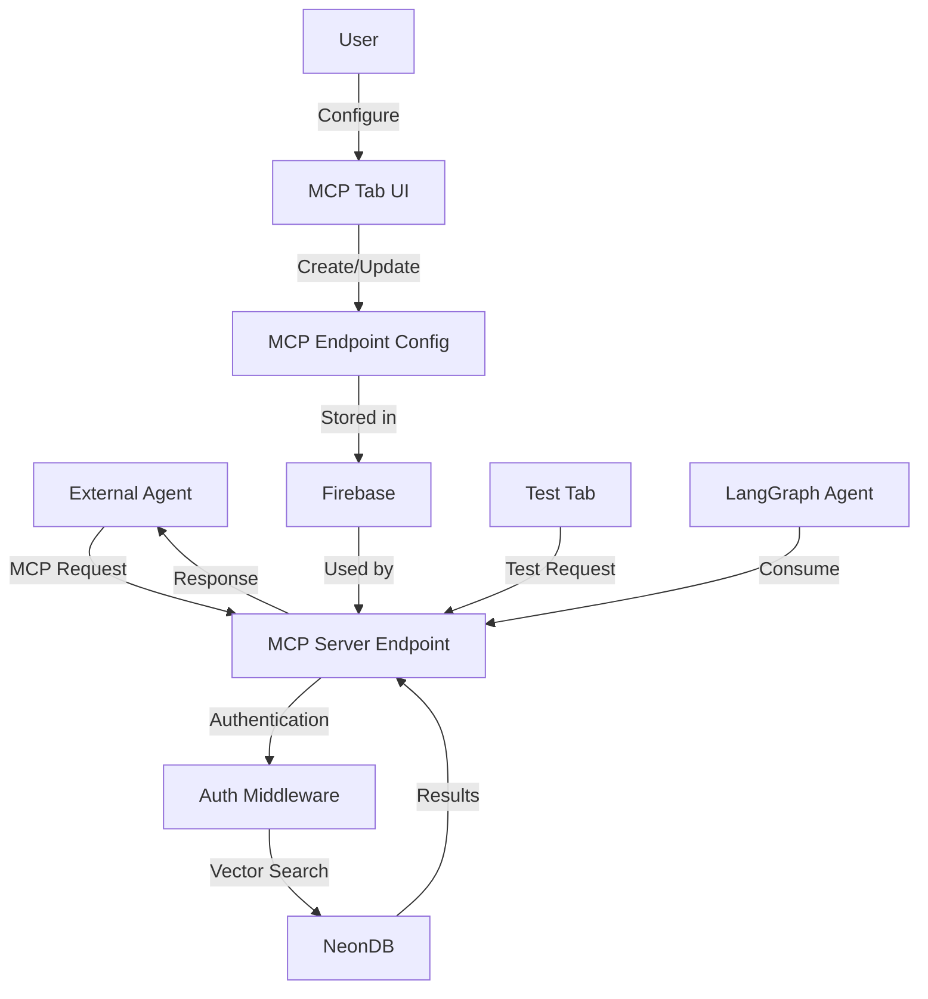

# Architecture Roadmap: MCP Server Endpoints for Vector Search

After analyzing the codebase, I've developed a comprehensive plan for implementing MCP server endpoints that expose vector search functionality for collections. This feature will allow external agents to access and search through collection documents via the Model Context Protocol.

## 1. System Overview



## 2. Data Schema

We'll need to extend the existing Collection schema to include MCP endpoint configuration:

```typescript
// New interface for MCP endpoint configuration
export interface McpEndpointConfig {
  id: string;
  collectionId: string;
  userId: string;
  name: string;
  description: string;
  isEnabled: boolean;
  authType: "api_key" | "bearer_token";
  authCredentials: {
    apiKey?: string;
    bearerToken?: string;
  };
  accessControl: {
    allowedIps: string[];
    rateLimitPerMinute: number;
  };
  createdAt: number;
  updatedAt: number;
}

// Schema for MCP endpoint configuration validation
export const mcpEndpointConfigSchema = z.object({
  name: z.string().min(1, "Name is required").max(100, "Name is too long"),
  description: z.string(),
  isEnabled: z.boolean().default(true),
  authType: z.enum(["api_key", "bearer_token"]),
  authCredentials: z.object({
    apiKey: z.string().optional(),
    bearerToken: z.string().optional(),
  }),
  accessControl: z.object({
    allowedIps: z.array(z.string()).default([]),
    rateLimitPerMinute: z.number().min(1).max(100).default(60),
  }),
});

export type McpEndpointConfigInput = z.infer<typeof mcpEndpointConfigSchema>;
```

## 3. Backend Implementation

### 3.1 Firebase Storage for MCP Configurations

We'll create a new collection in Firebase to store MCP endpoint configurations:

```typescript
// Path for MCP endpoint configurations
const getMcpEndpointConfigPath = (userId: string) =>
  `mcp_endpoints/${userId}/endpoints`;
const getMcpEndpointConfigDoc = (userId: string, endpointId: string) =>
  `${getMcpEndpointConfigPath(userId)}/${endpointId}`;

// CRUD operations for MCP endpoint configurations
export async function createMcpEndpointConfig(
  data: McpEndpointConfigInput,
  collectionId: string
) {
  try {
    const userId = await getCurrentUserId();
    if (!userId) {
      return { success: false, error: "User not authenticated" };
    }

    const endpointRef = adminDb
      .collection(getMcpEndpointConfigPath(userId))
      .doc();

    const timestamp = getCurrentUnixTimestamp();
    const endpointConfig: McpEndpointConfig = {
      id: endpointRef.id,
      userId,
      collectionId,
      name: data.name,
      description: data.description,
      isEnabled: data.isEnabled,
      authType: data.authType,
      authCredentials: data.authCredentials,
      accessControl: data.accessControl,
      createdAt: timestamp,
      updatedAt: timestamp,
    };

    await endpointRef.set(endpointConfig);

    return {
      success: true,
      id: endpointRef.id,
      endpointConfig,
    };
  } catch (error) {
    console.error("Error creating MCP endpoint config:", error);
    return {
      success: false,
      error:
        error instanceof Error
          ? error.message
          : "Failed to create MCP endpoint config",
    };
  }
}
```

### 3.2 API Endpoint for MCP Server

We'll create a new API endpoint that will handle MCP requests:

```typescript
// API route for MCP server endpoint
// /api/mcp/[endpointId]/route.ts
import { NextRequest, NextResponse } from "next/server";
import { getMcpEndpointConfig } from "@/lib/firebase/mcp-endpoints";
import { rateLimit } from "@/lib/rate-limit";
import { verifyAuth } from "@/lib/mcp-auth";
import { searchDocumentChunks } from "@/app/(protected)/mycollections/actions";

export async function POST(
  req: NextRequest,
  { params }: { params: { endpointId: string } }
) {
  try {
    const endpointId = params.endpointId;

    // Get endpoint configuration
    const result = await getMcpEndpointConfig(endpointId);
    if (!result.success || !result.endpointConfig) {
      return NextResponse.json(
        { error: "Endpoint not found" },
        { status: 404 }
      );
    }

    const config = result.endpointConfig;

    // Check if endpoint is enabled
    if (!config.isEnabled) {
      return NextResponse.json(
        { error: "Endpoint is disabled" },
        { status: 403 }
      );
    }

    // Verify authentication
    const authResult = verifyAuth(req, config);
    if (!authResult.success) {
      return NextResponse.json({ error: authResult.error }, { status: 401 });
    }

    // Apply rate limiting
    const rateLimitResult = await rateLimit(req, config);
    if (!rateLimitResult.success) {
      return NextResponse.json(
        { error: "Rate limit exceeded" },
        { status: 429 }
      );
    }

    // Process MCP request
    const requestBody = await req.json();

    // Forward request to searchDocumentChunks function
    const { query, limit = 10 } = requestBody;

    const searchResults = await searchDocumentChunks(
      query,
      config.collectionId,
      1,
      limit
    );

    return NextResponse.json(searchResults);
  } catch (error) {
    console.error("Error processing MCP request:", error);
    return NextResponse.json(
      { error: "Error processing your request" },
      { status: 500 }
    );
  }
}
```

### 3.3 Authentication and Rate Limiting

We'll implement authentication and rate limiting middleware:

```typescript
// lib/mcp-auth.ts
import { NextRequest } from "next/server";
import { McpEndpointConfig } from "@/lib/firebase/schema";

export function verifyAuth(req: NextRequest, config: McpEndpointConfig) {
  try {
    // Check IP restrictions if configured
    if (config.accessControl.allowedIps.length > 0) {
      const clientIp = req.headers.get("x-forwarded-for") || "unknown";
      if (!config.accessControl.allowedIps.includes(clientIp)) {
        return {
          success: false,
          error: "IP address not allowed",
        };
      }
    }

    // Verify authentication based on type
    if (config.authType === "api_key") {
      const apiKey = req.headers.get("x-api-key");
      if (!apiKey || apiKey !== config.authCredentials.apiKey) {
        return {
          success: false,
          error: "Invalid API key",
        };
      }
    } else if (config.authType === "bearer_token") {
      const authHeader = req.headers.get("authorization");
      if (!authHeader || !authHeader.startsWith("Bearer ")) {
        return {
          success: false,
          error: "Missing or invalid authorization header",
        };
      }

      const token = authHeader.substring(7); // Remove "Bearer " prefix
      if (token !== config.authCredentials.bearerToken) {
        return {
          success: false,
          error: "Invalid bearer token",
        };
      }
    }

    return { success: true };
  } catch (error) {
    console.error("Auth verification error:", error);
    return {
      success: false,
      error: "Authentication error",
    };
  }
}
```

```typescript
// lib/rate-limit.ts
import { NextRequest } from "next/server";
import { McpEndpointConfig } from "@/lib/firebase/schema";
import { Redis } from "@upstash/redis";

// Initialize Redis client for rate limiting
const redis = new Redis({
  url: process.env.UPSTASH_REDIS_REST_URL || "",
  token: process.env.UPSTASH_REDIS_REST_TOKEN || "",
});

export async function rateLimit(req: NextRequest, config: McpEndpointConfig) {
  try {
    const clientIp = req.headers.get("x-forwarded-for") || "unknown";
    const key = `rate-limit:${config.id}:${clientIp}`;

    // Get current count
    const count = (await redis.get<number>(key)) || 0;

    // Check if rate limit exceeded
    if (count >= config.accessControl.rateLimitPerMinute) {
      return {
        success: false,
        error: "Rate limit exceeded",
      };
    }

    // Increment count and set expiry
    await redis.incr(key);
    await redis.expire(key, 60); // 60 seconds (1 minute)

    return { success: true };
  } catch (error) {
    console.error("Rate limiting error:", error);
    // If rate limiting fails, allow the request to proceed
    return { success: true };
  }
}
```

## 4. Frontend Implementation

### 4.1 Update Collection Page with MCP Tab

First, we'll update the collection page to include the new MCP tab:

```tsx
// web/src/app/(protected)/mycollections/collection/page.tsx
// Add MCP tab to the existing tabs
<Tabs value={activeTab} onValueChange={setActiveTab} className="w-full">
  <TabsList className="mb-4">
    <TabsTrigger value="general">General</TabsTrigger>
    <TabsTrigger value="documents">Documents</TabsTrigger>
    <TabsTrigger value="search">Search</TabsTrigger>
    <TabsTrigger value="chat">Chat</TabsTrigger>
    <TabsTrigger value="mcp">MCP</TabsTrigger>
  </TabsList>

  {/* Existing tab content */}
  <TabsContent value="general" className="space-y-4">
    {/* ... */}
  </TabsContent>

  {/* ... other existing tabs ... */}

  {/* New MCP tab */}
  <McpTab collectionId={selectedCollection.id} />
</Tabs>
```

### 4.2 MCP Tab Component with Nested Tabs

```tsx
// MCP Tab Component for Collection Page
import { useState, useEffect } from "react";
import { TabsContent, Tabs, TabsList, TabsTrigger } from "@/components/ui/tabs";
import { McpEndpointConfig } from "@/lib/firebase/schema";
import { McpEndpointForm } from "./mcp-endpoint-form";
import { McpEndpointCard } from "./mcp-endpoint-card";
import { McpTestPanel } from "./mcp-test-panel";
import { Button } from "@/components/ui/button";
import { Plus, Loader2 } from "lucide-react";
import { useToast } from "@/hooks/use-toast";
import { getMcpEndpointConfigsByCollection } from "@/lib/firebase/mcp-endpoints";

interface McpTabProps {
  collectionId: string;
}

export function McpTab({ collectionId }: McpTabProps) {
  const [endpoints, setEndpoints] = useState<McpEndpointConfig[]>([]);
  const [isLoading, setIsLoading] = useState(true);
  const [isFormOpen, setIsFormOpen] = useState(false);
  const [endpointToEdit, setEndpointToEdit] = useState<
    McpEndpointConfig | undefined
  >(undefined);
  const [selectedEndpoint, setSelectedEndpoint] =
    useState<McpEndpointConfig | null>(null);
  const [activeSubTab, setActiveSubTab] = useState("endpoints");
  const { toast } = useToast();

  // Fetch MCP endpoints for this collection
  useEffect(() => {
    const fetchEndpoints = async () => {
      try {
        setIsLoading(true);
        const result = await getMcpEndpointConfigsByCollection(collectionId);
        if (result.success) {
          setEndpoints(result.endpoints || []);
          // Select the first endpoint for testing if available
          if (result.endpoints && result.endpoints.length > 0) {
            setSelectedEndpoint(result.endpoints[0]);
          }
        } else {
          toast({
            title: "Error",
            description: result.error || "Failed to fetch MCP endpoints",
            variant: "destructive",
          });
        }
      } catch (error) {
        toast({
          title: "Error",
          description:
            error instanceof Error ? error.message : "An error occurred",
          variant: "destructive",
        });
      } finally {
        setIsLoading(false);
      }
    };

    fetchEndpoints();
  }, [collectionId, toast]);

  const handleEndpointCreated = (endpoint: McpEndpointConfig) => {
    setEndpoints((prev) => [...prev, endpoint]);
    setIsFormOpen(false);
    // Select the newly created endpoint
    setSelectedEndpoint(endpoint);
  };

  const handleEndpointUpdated = (endpoint: McpEndpointConfig) => {
    setEndpoints((prev) =>
      prev.map((e) => (e.id === endpoint.id ? endpoint : e))
    );
    setIsFormOpen(false);
    setEndpointToEdit(undefined);
    // Update selected endpoint if it was the one being edited
    if (selectedEndpoint && selectedEndpoint.id === endpoint.id) {
      setSelectedEndpoint(endpoint);
    }
  };

  const handleEndpointDeleted = (endpointId: string) => {
    setEndpoints((prev) => prev.filter((e) => e.id !== endpointId));
    // Clear selected endpoint if it was deleted
    if (selectedEndpoint && selectedEndpoint.id === endpointId) {
      setSelectedEndpoint(null);
    }
  };

  return (
    <TabsContent value="mcp" className="space-y-4">
      <div className="flex justify-between items-center">
        <div>
          <h2 className="text-xl font-semibold">MCP Endpoints</h2>
          <p className="text-muted-foreground">
            Create and manage MCP endpoints for external agents to access this
            collection
          </p>
        </div>
      </div>

      <Tabs
        value={activeSubTab}
        onValueChange={setActiveSubTab}
        className="w-full"
      >
        <TabsList className="mb-4">
          <TabsTrigger value="endpoints">Endpoints</TabsTrigger>
          <TabsTrigger value="test" disabled={!selectedEndpoint}>
            Test
          </TabsTrigger>
        </TabsList>

        {/* Endpoints Tab */}
        <TabsContent value="endpoints" className="space-y-4">
          <div className="flex justify-end">
            <Button onClick={() => setIsFormOpen(true)}>
              <Plus className="mr-2 h-4 w-4" />
              Create Endpoint
            </Button>
          </div>

          {isLoading ? (
            <div className="flex items-center justify-center p-8">
              <Loader2 className="h-8 w-8 animate-spin text-muted-foreground" />
            </div>
          ) : endpoints.length === 0 ? (
            <div className="text-center py-10 border rounded-lg">
              <h3 className="text-lg font-medium mb-2">No MCP endpoints yet</h3>
              <p className="text-muted-foreground mb-6">
                Create an MCP endpoint to allow external agents to search this
                collection
              </p>
              <Button onClick={() => setIsFormOpen(true)}>
                <Plus className="mr-2 h-4 w-4" />
                Create First Endpoint
              </Button>
            </div>
          ) : (
            <div className="grid grid-cols-1 md:grid-cols-2 gap-4">
              {endpoints.map((endpoint) => (
                <McpEndpointCard
                  key={endpoint.id}
                  endpoint={endpoint}
                  onEdit={() => {
                    setEndpointToEdit(endpoint);
                    setIsFormOpen(true);
                  }}
                  onDelete={handleEndpointDeleted}
                  onSelect={() => {
                    setSelectedEndpoint(endpoint);
                    setActiveSubTab("test");
                  }}
                  isSelected={selectedEndpoint?.id === endpoint.id}
                />
              ))}
            </div>
          )}
        </TabsContent>

        {/* Test Tab */}
        <TabsContent value="test" className="space-y-4">
          {selectedEndpoint ? (
            <McpTestPanel endpoint={selectedEndpoint} />
          ) : (
            <div className="text-center py-10 border rounded-lg">
              <h3 className="text-lg font-medium mb-2">No endpoint selected</h3>
              <p className="text-muted-foreground mb-6">
                Please select an endpoint to test
              </p>
              <Button onClick={() => setActiveSubTab("endpoints")}>
                Go to Endpoints
              </Button>
            </div>
          )}
        </TabsContent>
      </Tabs>

      {isFormOpen && (
        <McpEndpointForm
          isOpen={isFormOpen}
          onClose={() => {
            setIsFormOpen(false);
            setEndpointToEdit(undefined);
          }}
          collectionId={collectionId}
          endpointToEdit={endpointToEdit}
          onCreated={handleEndpointCreated}
          onUpdated={handleEndpointUpdated}
        />
      )}
    </TabsContent>
  );
}
```

### 4.3 MCP Endpoint Card Component with Select Option

```tsx
// MCP Endpoint Card Component
import { useState } from "react";
import {
  Card,
  CardContent,
  CardFooter,
  CardHeader,
  CardTitle,
} from "@/components/ui/card";
import { Button } from "@/components/ui/button";
import { Badge } from "@/components/ui/badge";
import { Switch } from "@/components/ui/switch";
import { Copy, Edit, Trash2, PlayCircle } from "lucide-react";
import { McpEndpointConfig } from "@/lib/firebase/schema";
import { useToast } from "@/hooks/use-toast";
import {
  deleteMcpEndpointConfig,
  updateMcpEndpointConfig,
} from "@/lib/firebase/mcp-endpoints";
import {
  AlertDialog,
  AlertDialogAction,
  AlertDialogCancel,
  AlertDialogContent,
  AlertDialogDescription,
  AlertDialogFooter,
  AlertDialogHeader,
  AlertDialogTitle,
} from "@/components/ui/alert-dialog";

interface McpEndpointCardProps {
  endpoint: McpEndpointConfig;
  onEdit: () => void;
  onDelete: (endpointId: string) => void;
  onSelect: () => void;
  isSelected: boolean;
}

export function McpEndpointCard({
  endpoint,
  onEdit,
  onDelete,
  onSelect,
  isSelected,
}: McpEndpointCardProps) {
  const [isDeleteDialogOpen, setIsDeleteDialogOpen] = useState(false);
  const [isUpdating, setIsUpdating] = useState(false);
  const { toast } = useToast();

  // Generate endpoint URL
  const endpointUrl = `${window.location.origin}/api/mcp/${endpoint.id}`;

  const handleCopyUrl = () => {
    navigator.clipboard.writeText(endpointUrl);
    toast({
      title: "Copied!",
      description: "Endpoint URL copied to clipboard",
    });
  };

  const handleToggleEnabled = async () => {
    setIsUpdating(true);
    try {
      const result = await updateMcpEndpointConfig(endpoint.id, {
        ...endpoint,
        isEnabled: !endpoint.isEnabled,
      });

      if (result.success) {
        toast({
          title: "Success",
          description: `Endpoint ${
            !endpoint.isEnabled ? "enabled" : "disabled"
          } successfully`,
        });
        // Update the endpoint in the parent component
        if (result.endpointConfig) {
          onDelete(endpoint.id); // Remove old version
          onEdit(); // Trigger refetch
        }
      } else {
        toast({
          title: "Error",
          description: result.error || "Failed to update endpoint status",
          variant: "destructive",
        });
      }
    } catch (error) {
      toast({
        title: "Error",
        description:
          error instanceof Error ? error.message : "An error occurred",
        variant: "destructive",
      });
    } finally {
      setIsUpdating(false);
    }
  };

  const handleDelete = async () => {
    try {
      const result = await deleteMcpEndpointConfig(endpoint.id);

      if (result.success) {
        toast({
          title: "Success",
          description: "Endpoint deleted successfully",
        });
        onDelete(endpoint.id);
      } else {
        toast({
          title: "Error",
          description: result.error || "Failed to delete endpoint",
          variant: "destructive",
        });
      }
    } catch (error) {
      toast({
        title: "Error",
        description:
          error instanceof Error ? error.message : "An error occurred",
        variant: "destructive",
      });
    } finally {
      setIsDeleteDialogOpen(false);
    }
  };

  return (
    <>
      <Card className={isSelected ? "border-primary" : ""}>
        <CardHeader className="pb-2">
          <div className="flex justify-between items-start">
            <CardTitle className="text-lg">{endpoint.name}</CardTitle>
            <Badge variant={endpoint.isEnabled ? "default" : "secondary"}>
              {endpoint.isEnabled ? "Enabled" : "Disabled"}
            </Badge>
          </div>
        </CardHeader>
        <CardContent className="space-y-2">
          <p className="text-sm text-muted-foreground">
            {endpoint.description}
          </p>

          <div className="mt-4">
            <p className="text-xs font-medium text-muted-foreground">
              ENDPOINT URL
            </p>
            <div className="flex items-center mt-1">
              <code className="text-xs bg-muted p-1 rounded flex-1 truncate">
                {endpointUrl}
              </code>
              <Button variant="ghost" size="sm" onClick={handleCopyUrl}>
                <Copy className="h-4 w-4" />
              </Button>
            </div>
          </div>

          <div className="mt-2">
            <p className="text-xs font-medium text-muted-foreground">
              AUTH TYPE
            </p>
            <p className="text-sm">
              {endpoint.authType === "api_key" ? "API Key" : "Bearer Token"}
            </p>
          </div>

          <div className="mt-2">
            <p className="text-xs font-medium text-muted-foreground">
              RATE LIMIT
            </p>
            <p className="text-sm">
              {endpoint.accessControl.rateLimitPerMinute} requests/minute
            </p>
          </div>
        </CardContent>
        <CardFooter className="flex justify-between">
          <div className="flex items-center space-x-2">
            <Switch
              checked={endpoint.isEnabled}
              onCheckedChange={handleToggleEnabled}
              disabled={isUpdating}
            />
            <span className="text-sm">
              {isUpdating
                ? "Updating..."
                : endpoint.isEnabled
                ? "Enabled"
                : "Disabled"}
            </span>
          </div>
          <div className="flex space-x-2">
            <Button
              variant="outline"
              size="sm"
              onClick={onSelect}
              title="Test Endpoint"
            >
              <PlayCircle className="h-4 w-4" />
            </Button>
            <Button
              variant="outline"
              size="sm"
              onClick={onEdit}
              title="Edit Endpoint"
            >
              <Edit className="h-4 w-4" />
            </Button>
            <Button
              variant="outline"
              size="sm"
              onClick={() => setIsDeleteDialogOpen(true)}
              title="Delete Endpoint"
            >
              <Trash2 className="h-4 w-4" />
            </Button>
          </div>
        </CardFooter>
      </Card>

      <AlertDialog
        open={isDeleteDialogOpen}
        onOpenChange={setIsDeleteDialogOpen}
      >
        <AlertDialogContent>
          <AlertDialogHeader>
            <AlertDialogTitle>Delete MCP Endpoint</AlertDialogTitle>
            <AlertDialogDescription>
              Are you sure you want to delete this endpoint? This action cannot
              be undone.
            </AlertDialogDescription>
          </AlertDialogHeader>
          <AlertDialogFooter>
            <AlertDialogCancel>Cancel</AlertDialogCancel>
            <AlertDialogAction
              onClick={handleDelete}
              className="bg-destructive text-destructive-foreground"
            >
              Delete
            </AlertDialogAction>
          </AlertDialogFooter>
        </AlertDialogContent>
      </AlertDialog>
    </>
  );
}
```

### 4.4 MCP Test Panel Component

```tsx
// MCP Test Panel Component
import { useState } from "react";
import { Card, CardContent, CardHeader, CardTitle } from "@/components/ui/card";
import { Button } from "@/components/ui/button";
import { Input } from "@/components/ui/input";
import { Label } from "@/components/ui/label";
import { Textarea } from "@/components/ui/textarea";
import { Loader2 } from "lucide-react";
import { McpEndpointConfig } from "@/lib/firebase/schema";
import { useToast } from "@/hooks/use-toast";

interface McpTestPanelProps {
  endpoint: McpEndpointConfig;
}

export function McpTestPanel({ endpoint }: McpTestPanelProps) {
  const [query, setQuery] = useState("");
  const [limit, setLimit] = useState("10");
  const [isLoading, setIsLoading] = useState(false);
  const [response, setResponse] = useState<any>(null);
  const [error, setError] = useState<string | null>(null);
  const { toast } = useToast();

  // Generate endpoint URL
  const endpointUrl = `${window.location.origin}/api/mcp/${endpoint.id}`;

  const handleTest = async () => {
    if (!query.trim()) {
      toast({
        title: "Error",
        description: "Please enter a search query",
        variant: "destructive",
      });
      return;
    }

    setIsLoading(true);
    setError(null);
    setResponse(null);

    try {
      // Prepare headers based on auth type
      const headers: Record<string, string> = {
        "Content-Type": "application/json",
      };

      if (endpoint.authType === "api_key") {
        headers["x-api-key"] = endpoint.authCredentials.apiKey || "";
      } else if (endpoint.authType === "bearer_token") {
        headers["Authorization"] = `Bearer ${
          endpoint.authCredentials.bearerToken || ""
        }`;
      }

      // Make the request
      const res = await fetch(endpointUrl, {
        method: "POST",
        headers,
        body: JSON.stringify({
          query,
          limit: parseInt(limit) || 10,
        }),
      });

      const data = await res.json();

      if (!res.ok) {
        throw new Error(data.error || `Error: ${res.status}`);
      }

      setResponse(data);
    } catch (err) {
      setError(err instanceof Error ? err.message : "An error occurred");
      toast({
        title: "Error",
        description: err instanceof Error ? err.message : "An error occurred",
        variant: "destructive",
      });
    } finally {
      setIsLoading(false);
    }
  };

  return (
    <div className="space-y-6">
      <Card>
        <CardHeader>
          <CardTitle>Test MCP Endpoint</CardTitle>
        </CardHeader>
        <CardContent className="space-y-4">
          <div className="space-y-2">
            <Label htmlFor="endpoint-url">Endpoint URL</Label>
            <Input
              id="endpoint-url"
              value={endpointUrl}
              readOnly
              className="bg-muted"
            />
          </div>

          <div className="space-y-2">
            <Label htmlFor="auth-type">Authentication Type</Label>
            <Input
              id="auth-type"
              value={
                endpoint.authType === "api_key" ? "API Key" : "Bearer Token"
              }
              readOnly
              className="bg-muted"
            />
          </div>

          <div className="space-y-2">
            <Label htmlFor="auth-value">
              {endpoint.authType === "api_key" ? "API Key" : "Bearer Token"}
            </Label>
            <Input
              id="auth-value"
              value={
                endpoint.authType === "api_key"
                  ? endpoint.authCredentials.apiKey || ""
                  : endpoint.authCredentials.bearerToken || ""
              }
              readOnly
              className="bg-muted"
              type="password"
            />
          </div>

          <div className="space-y-2">
            <Label htmlFor="query">Search Query</Label>
            <Input
              id="query"
              value={query}
              onChange={(e) => setQuery(e.target.value)}
              placeholder="Enter your search query"
              disabled={isLoading}
            />
          </div>

          <div className="space-y-2">
            <Label htmlFor="limit">Result Limit</Label>
            <Input
              id="limit"
              value={limit}
              onChange={(e) => setLimit(e.target.value)}
              type="number"
              min="1"
              max="50"
              disabled={isLoading}
            />
          </div>

          <Button
            onClick={handleTest}
            disabled={isLoading || !query.trim()}
            className="w-full"
          >
            {isLoading ? (
              <>
                <Loader2 className="mr-2 h-4 w-4 animate-spin" />
                Testing...
              </>
            ) : (
              "Test Endpoint"
            )}
          </Button>
        </CardContent>
      </Card>

      {(response || error) && (
        <Card>
          <CardHeader>
            <CardTitle>Response</CardTitle>
          </CardHeader>
          <CardContent>
            {error ? (
              <div className="p-4 bg-destructive/10 text-destructive rounded-md">
                <p className="font-medium">Error</p>
                <p>{error}</p>
              </div>
            ) : (
              <div className="space-y-4">
                <div className="flex justify-between">
                  <p className="text-sm text-muted-foreground">
                    Found {response.totalResults || 0} results
                  </p>
                  <p className="text-sm text-muted-foreground">
                    Page {response.page || 1} of {response.totalPages || 1}
                  </p>
                </div>
                <Textarea
                  value={JSON.stringify(response, null, 2)}
                  readOnly
                  className="font-mono text-sm h-80"
                />
              </div>
            )}
          </CardContent>
        </Card>
      )}

      {/* Code snippet section */}
      <Card>
        <CardHeader>
          <CardTitle>Usage Example</CardTitle>
        </CardHeader>
        <CardContent>
          <div className="space-y-4">
            <p className="text-sm text-muted-foreground">
              Here's how to use this endpoint in your code:
            </p>

            <div className="space-y-2">
              <Label>JavaScript/TypeScript</Label>
              <Textarea
                readOnly
                className="font-mono text-sm h-48"
                value={`// Example code to query the MCP endpoint
const searchDocuments = async (query) => {
  try {
    const response = await fetch("${endpointUrl}", {
      method: "POST",
      headers: {
        "Content-Type": "application/json",
        ${
          endpoint.authType === "api_key"
            ? `"x-api-key": "YOUR_API_KEY"`
            : `"Authorization": "Bearer YOUR_BEARER_TOKEN"`
        }
      },
      body: JSON.stringify({
        query: query,
        limit: 10
      })
    });

    const data = await response.json();
    return data;
  } catch (error) {
    console.error("Error searching documents:", error);
    throw error;
  }
};

// Usage
searchDocuments("your search query")
  .then(results => console.log(results))
  .catch(error => console.error(error));`}
              />
            </div>

            <div className="space-y-2">
              <Label>Python</Label>
              <Textarea
                readOnly
                className="font-mono text-sm h-48"
                value={`# Example code to query the MCP endpoint
import requests
import json

def search_documents(query, limit=10):
    url = "${endpointUrl}"
    
    headers = {
        "Content-Type": "application/json",
        ${
          endpoint.authType === "api_key"
            ? `"x-api-key": "YOUR_API_KEY"`
            : `"Authorization": "Bearer YOUR_BEARER_TOKEN"`
        }
    }
    
    payload = {
        "query": query,
        "limit": limit
    }
    
    try:
        response = requests.post(url, headers=headers, json=payload)
        response.raise_for_status()  # Raise exception for 4XX/5XX responses
        return response.json()
    except Exception as e:
        print(f"Error searching documents: {e}")
        raise

# Usage
try:
    results = search_documents("your search query")
    print(json.dumps(results, indent=2))
except Exception as e:
    print(f"Error: {e}")`}
              />
            </div>
          </div>
        </CardContent>
      </Card>
    </div>
  );
}
```

## 5. LangGraph Agent Test Script

We'll create a test script using LangGraph that demonstrates how to consume the MCP server endpoint. This script will be placed in the project root directory.

```typescript
// scripts/test-mcp-agent.ts
import { config } from "dotenv";
import { ChatOpenAI } from "@langchain/openai";
import { StateGraph, StateGraphArgs } from "@langchain/langgraph";
import { RunnableSequence } from "@langchain/core/runnables";
import { StructuredTool } from "@langchain/core/tools";
import {
  ChatPromptTemplate,
  MessagesPlaceholder,
} from "@langchain/core/prompts";
import { AgentExecutor } from "langchain/agents";
import { convertToOpenAIFunction } from "@langchain/core/utils/function_calling";

// Load environment variables from .env.local
config({ path: ".env.local" });

// Define the state interface
interface AgentState {
  messages: any[];
  steps: any[];
}

// Validate environment variables
const requiredEnvVars = [
  "MCP_ENDPOINT_URL",
  "MCP_AUTH_TYPE",
  "MCP_AUTH_VALUE",
  "OPENAI_API_KEY",
];

for (const envVar of requiredEnvVars) {
  if (!process.env[envVar]) {
    console.error(`Error: ${envVar} is not set in .env.local file`);
    process.exit(1);
  }
}

// Create a tool to search documents using the MCP endpoint
class SearchDocumentsTool extends StructuredTool {
  name = "search_documents";
  description = "Search for information in documents using vector similarity";
  schema = {
    type: "object",
    properties: {
      query: {
        type: "string",
        description: "The search query",
      },
      limit: {
        type: "number",
        description: "Maximum number of results to return (default: 5)",
      },
    },
    required: ["query"],
  };

  async _call({ query, limit = 5 }: { query: string; limit?: number }) {
    try {
      // Prepare headers based on auth type
      const headers: Record<string, string> = {
        "Content-Type": "application/json",
      };

      if (process.env.MCP_AUTH_TYPE === "api_key") {
        headers["x-api-key"] = process.env.MCP_AUTH_VALUE || "";
      } else if (process.env.MCP_AUTH_TYPE === "bearer_token") {
        headers["Authorization"] = `Bearer ${process.env.MCP_AUTH_VALUE || ""}`;
      }

      // Make the request to the MCP endpoint
      const response = await fetch(process.env.MCP_ENDPOINT_URL!, {
        method: "POST",
        headers,
        body: JSON.stringify({
          query,
          limit,
        }),
      });

      if (!response.ok) {
        const errorData = await response.json();
        throw new Error(
          `Error searching documents: ${errorData.error || response.statusText}`
        );
      }

      const data = await response.json();

      // Format the results for better readability
      if (data.success && data.results && data.results.length > 0) {
        const formattedResults = data.results.map((result: any) => ({
          document_title: result.document_title,
          content: result.chunk_content,
          similarity: result.similarity,
        }));

        return JSON.stringify(formattedResults, null, 2);
      } else {
        return "No results found for the given query.";
      }
    } catch (error) {
      return `Error: ${
        error instanceof Error ? error.message : "Unknown error"
      }`;
    }
  }
}

async function main() {
  // Create the language model
  const model = new ChatOpenAI({
    modelName: "gpt-4o-mini",
    temperature: 0,
  });

  // Create the search documents tool
  const searchDocumentsTool = new SearchDocumentsTool();
  const tools = [searchDocumentsTool];

  // Create the prompt template
  const prompt = ChatPromptTemplate.fromMessages([
    [
      "system",
      `You are a helpful assistant that answers questions based on document search results.
    
When asked a question, use the search_documents tool to find relevant information in the documents.
Analyze the search results and provide a comprehensive answer based on the information found.
If the search doesn't return relevant results, acknowledge that you don't have enough information to answer.
Always cite the document titles where you found the information.`,
    ],
    new MessagesPlaceholder("messages"),
    new MessagesPlaceholder("agent_scratchpad"),
  ]);

  // Create the agent
  const toolsAsOpenAIFunctions = tools.map((tool) =>
    convertToOpenAIFunction(tool)
  );

  // Define the agent executor
  const agent = RunnableSequence.from([
    {
      messages: (state: AgentState) => state.messages,
      agent_scratchpad: (state: AgentState) => state.steps,
    },
    prompt,
    model.bind({ functions: toolsAsOpenAIFunctions }),
    AgentExecutor.fromLLMAndTools({
      llm: model,
      tools,
    }),
  ]);

  // Define the state graph
  const workflow = new StateGraph<AgentState>({
    channels: {
      messages: {
        value: (x: any, y: any) => y,
        default: () => [],
      },
      steps: {
        value: (x: any, y: any) => [...(x || []), y],
        default: () => [],
      },
    },
  });

  // Add the agent node
  workflow.addNode("agent", agent);

  // Set the entry point
  workflow.setEntryPoint("agent");

  // Compile the workflow
  const app = workflow.compile();

  // Run the agent with a sample question
  console.log("Starting MCP agent test...");
  console.log(`Using MCP endpoint: ${process.env.MCP_ENDPOINT_URL}`);
  console.log("Enter your question (or type 'exit' to quit):");

  // Set up readline for interactive input
  const readline = require("readline").createInterface({
    input: process.stdin,
    output: process.stdout,
  });

  // Function to handle user input
  const askQuestion = () => {
    readline.question("> ", async (question: string) => {
      if (question.toLowerCase() === "exit") {
        console.log("Exiting...");
        readline.close();
        return;
      }

      try {
        const result = await app.invoke({
          messages: [{ role: "user", content: question }],
          steps: [],
        });

        // Extract and display the assistant's response
        const assistantMessages = result.messages.filter(
          (msg: any) => msg.role === "assistant"
        );
        if (assistantMessages.length > 0) {
          console.log("\nAssistant:");
          console.log(assistantMessages[assistantMessages.length - 1].content);
        }
      } catch (error) {
        console.error("Error:", error);
      }

      console.log("\nEnter your next question (or type 'exit' to quit):");
      askQuestion();
    });
  };

  // Start the conversation
  askQuestion();
}

// Run the main function
main().catch((error) => {
  console.error("Error:", error);
  process.exit(1);
});
```

### 5.1 Sample .env.local File

```
# MCP Endpoint Configuration
MCP_ENDPOINT_URL=http://localhost:3000/api/mcp/your-endpoint-id
MCP_AUTH_TYPE=api_key  # or bearer_token
MCP_AUTH_VALUE=your-api-key-or-bearer-token

# OpenAI API Key for LangGraph Agent
OPENAI_API_KEY=your-openai-api-key
```

### 5.2 Package.json Script

Add the following script to package.json:

```json
{
  "scripts": {
    // ... existing scripts
    "test-mcp-agent": "ts-node scripts/test-mcp-agent.ts"
  }
}
```

## 6. Implementation Plan

1. **Phase 1: Data Schema and Backend**

   - Add MCP endpoint configuration schema to Firebase schema
   - Implement CRUD operations for MCP endpoints
   - Create authentication and rate limiting utilities

2. **Phase 2: API Endpoint**

   - Implement the MCP API endpoint for handling requests
   - Add error handling and logging
   - Test with sample requests

3. **Phase 3: Frontend Components**

   - Add MCP tab to collection page
   - Implement MCP endpoint form component
   - Implement MCP endpoint card component
   - Implement MCP test panel component
   - Add copy-to-clipboard functionality

4. **Phase 4: LangGraph Agent Test Script**

   - Create the test script using LangGraph
   - Implement the SearchDocumentsTool
   - Add interactive CLI interface
   - Create sample .env.local template

5. **Phase 5: Testing and Documentation**
   - Test the complete flow from endpoint creation to usage
   - Test the LangGraph agent with the MCP endpoint
   - Create documentation for external agents on how to use the endpoints
   - Add usage examples for different programming languages

## 7. Security Considerations

- All endpoints will require authentication (API key or bearer token)
- Rate limiting will prevent abuse
- IP whitelisting will provide an additional layer of security
- Credentials will be stored securely in Firebase
- All requests will be logged for audit purposes

## 8. Usage Instructions

### 8.1 Creating and Testing an MCP Endpoint

1. Navigate to the Collections page
2. Select a collection
3. Go to the MCP tab
4. Create a new endpoint with a name, description, and authentication settings
5. Switch to the Test tab to test the endpoint with sample queries
6. Copy the endpoint URL and credentials for use in external applications

### 8.2 Using the LangGraph Agent Test Script

1. Create a `.env.local` file in the project root with the required environment variables
2. Install the required dependencies: `npm install dotenv @langchain/openai @langchain/langgraph @langchain/core langchain`
3. Run the test script: `npm run test-mcp-agent`
4. Enter questions to test the agent's ability to search and retrieve information from your collection

This architecture provides a secure, scalable, and user-friendly way for users to expose their collection's vector search functionality to external agents through MCP server endpoints, complete with testing capabilities and a sample LangGraph agent implementation.
