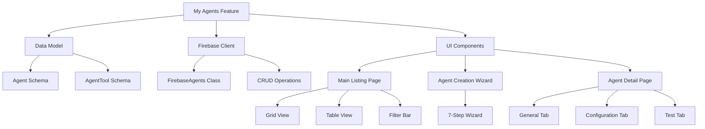

# My Agents Feature Implementation Plan

Based on my analysis of the existing codebase, I've created a comprehensive plan for implementing the "My Agents" feature in LaunchpadAI. This feature will allow users to create and expose their own AI agents for use outside of LaunchpadAI.

## 1. Overview

The My Agents feature will follow a similar structure to the existing My Stacks feature, with:

- A main listing page at `/myagents` with grid and table views
- A wizard-based creation flow at `/myagents/create`
- A detailed agent view at `/myagents/agent` with tabs for different functionality

## 2. Data Model

### 2.1 Agent Schema

First, we'll define the Agent schema in `web/src/lib/firebase/schema.ts`:

```typescript
// Agent status type
export type AgentStatus = "enabled" | "disabled" | "configuring";

// Agent schema
export interface Agent {
  id: string;
  userId: string;
  name: string;
  description: string;
  phases: Phases[];
  tags: string[];
  collections: string[]; // IDs of collections used as knowledge base
  tools: string[]; // IDs of enabled tools
  mcpEndpoints: string[]; // IDs of MCP endpoints
  a2aEndpoints: string[]; // IDs of Agent2Agent endpoints
  configuration: {
    url: string;
    apiKey: string;
    rateLimitPerMinute: number;
    allowedIps: string[];
    isEnabled: boolean;
  };
  createdAt?: number;
  updatedAt?: number;
}

// Agent input schema (for validation)
export const agentInputSchema = z.object({
  name: z.string().min(1, "Name is required").max(100, "Name is too long"),
  description: z.string(),
  phases: z.array(z.nativeEnum(Phases)).default([]),
  tags: z.array(z.string()).default([]),
  collections: z.array(z.string()).default([]),
  tools: z.array(z.string()).default([]),
  mcpEndpoints: z.array(z.string()).default([]),
  a2aEndpoints: z.array(z.string()).default([]),
  configuration: z.object({
    url: z.string().optional(),
    apiKey: z.string().optional(),
    rateLimitPerMinute: z.number().min(1).max(1000).default(60),
    allowedIps: z.array(z.string()).default([]),
    isEnabled: z.boolean().default(false),
  }),
});

export type AgentInput = z.infer<typeof agentInputSchema>;

// Tool schema for agent tools
export interface AgentTool {
  id: string;
  name: string;
  description: string;
  provider: string;
  apiKeyRequired: boolean;
  isEnabled: boolean;
  apiKey?: string;
  createdAt?: number;
  updatedAt?: number;
}

export const agentToolSchema = z.object({
  name: z.string().min(1, "Name is required"),
  description: z.string(),
  provider: z.string(),
  apiKeyRequired: z.boolean().default(true),
  isEnabled: z.boolean().default(false),
  apiKey: z.string().optional(),
});

export type AgentToolInput = z.infer<typeof agentToolSchema>;
```

## 3. Firebase Client Class

### 3.1 FirebaseAgents Class

Create a new file `web/src/lib/firebase/client/FirebaseAgents.ts`:

```typescript
import { getAuth } from "firebase/auth";
import {
  collection,
  DocumentData,
  getFirestore,
  orderBy,
  query,
  where,
  FirestoreDataConverter,
  QueryDocumentSnapshot,
  SnapshotOptions,
  CollectionReference,
  addDoc,
  getDoc,
  updateDoc,
  doc,
  DocumentReference,
  deleteDoc,
} from "firebase/firestore";
import { getStorage } from "firebase/storage";
import { clientApp, clientAuth, clientDb } from "@/lib/firebase/client";
import { Agent, Phases } from "../schema";
import { getCurrentUnixTimestamp } from "@/utils/constants";

const agentConverter: FirestoreDataConverter<Agent> = {
  toFirestore: (agent) => agent,
  fromFirestore(
    snapshot: QueryDocumentSnapshot,
    options: SnapshotOptions
  ): Agent {
    const data = snapshot.data(options) as Agent;
    return {
      ...data,
      id: snapshot.id,
    };
  },
};

class FirebaseAgents {
  auth: ReturnType<typeof getAuth>;
  db: ReturnType<typeof getFirestore>;
  storage: ReturnType<typeof getStorage>;
  collectionName: string;

  constructor() {
    try {
      if (!clientAuth || !clientDb || !clientApp) {
        throw new Error("Firebase client instances are not initialized");
      }

      this.auth = clientAuth;
      this.db = clientDb;
      this.storage = getStorage(clientApp);
      this.collectionName = "myagents";
    } catch (error) {
      console.error("[FirebaseAgents][constructor] Error initializing:", error);
      throw error;
    }
  }

  getRefCollection(): CollectionReference<Agent> {
    if (!this.auth || !this.auth.currentUser) {
      console.log("[FirebaseAgents][getRefCollection] User not authenticated");
    }

    let userId = this.auth.currentUser?.uid;
    if (!userId) {
      userId = "default";
    }

    return collection(
      this.db,
      `${this.collectionName}/${userId}/${this.collectionName}`
    ).withConverter(agentConverter);
  }

  getRefDocument(id: string): DocumentReference<Agent> {
    if (!this.auth || !this.auth.currentUser) {
      console.log("[FirebaseAgents][getRefDocument] User not authenticated");
    }

    let userId = this.auth.currentUser?.uid;
    if (!userId) {
      userId = "default";
    }
    return doc(
      this.db,
      `${this.collectionName}/${userId}/${this.collectionName}/${id}`
    ).withConverter(agentConverter);
  }

  getAgents(): Query<DocumentData, DocumentData> | null {
    try {
      const agentsQuery = query(
        this.getRefCollection(),
        orderBy("updatedAt", "desc")
      );

      return agentsQuery;
    } catch (error) {
      console.error("[FirebaseAgents][getAgents] Error:", error);
      return null;
    }
  }

  getAgentsByPhase(phases: Phases[]): Query<DocumentData, DocumentData> | null {
    try {
      const agentsQuery = query(
        this.getRefCollection(),
        where("phases", "array-contains-any", phases),
        orderBy("updatedAt", "desc")
      );

      return agentsQuery;
    } catch (error) {
      console.error("[FirebaseAgents][getAgentsByPhase] Error:", error);
      return null;
    }
  }

  async createAgent(agent: Agent): Promise<Agent | null> {
    try {
      const ref = this.getRefCollection();
      const docRef = await addDoc(ref, {
        ...agent,
        createdAt: getCurrentUnixTimestamp(),
        updatedAt: getCurrentUnixTimestamp(),
      });
      const docData = await getDoc(docRef);
      return docData.data() as Agent;
    } catch (error) {
      console.error("[FirebaseAgents][createAgent] Error:", error);
      return null;
    }
  }

  async updateAgent(agent: Agent): Promise<Agent | null> {
    try {
      const ref = this.getRefDocument(agent.id);
      const docRef = await updateDoc(ref, {
        ...agent,
        updatedAt: getCurrentUnixTimestamp(),
      });
      const docData = await getDoc(ref);
      return docData.data() as Agent;
    } catch (error) {
      console.error("[FirebaseAgents][updateAgent] Error:", error);
      return null;
    }
  }

  async deleteAgent(id: string): Promise<boolean> {
    try {
      const ref = this.getRefDocument(id);
      await deleteDoc(ref);
      return true;
    } catch (error) {
      console.error("[FirebaseAgents][deleteAgent] Error:", error);
      return false;
    }
  }
}

export const firebaseAgents = new FirebaseAgents();
export default FirebaseAgents;
```

## 4. State Management

### 4.1 Agent Store

Create a new file `web/src/lib/store/agent-store.ts`:

```typescript
import { atom } from "jotai";
import { Agent } from "@/lib/firebase/schema";

// View mode atom (grid or table)
export const agentLayoutViewAtom = atom<"card" | "table">("card");

// Phase filter atom
export const agentPhaseFilterAtom = atom<string[]>([]);

// Search query atom
export const agentSearchQueryAtom = atom<string>("");

// Selected agent atom
export const selectedAgentAtom = atom<Agent | null>(null);

// Agent wizard state atom
export const agentWizardStateAtom = atom<Agent | null>(null);

// Current wizard step atom
export const currentWizardStepAtom = atom<number>(1);

// Edit mode atom
export const isEditModeAtom = atom<boolean>(false);

// Table row selection atom
export const agentTableRowSelectionAtom = atom<Record<string, boolean>>({});

// Optimistic update atoms for delete operations
export const deleteAgentAtom = atom(null, (get, set, agentId: string) => {
  // Implementation for optimistic delete
});

export const deleteMultipleAgentsAtom = atom(
  null,
  (get, set, agentIds: string[]) => {
    // Implementation for optimistic delete of multiple agents
  }
);
```

## 5. Implementation Steps

### Phase 1: Core Infrastructure

1. Add Agent schema to `web/src/lib/firebase/schema.ts`
2. Create `FirebaseAgents.ts` client class
3. Create agent store with Jotai atoms
4. Update FilterBar component to support "agents" mode

### Phase 2: Main Agents Page

1. Create `/myagents` page with grid and table views
2. Implement filter bar integration
3. Create agent data table component with Tanstack Table
4. Add agent card component for grid view

### Phase 3: Agent Creation Wizard

1. Create wizard layout and navigation
2. Implement the 7 wizard steps:
   - Basic Info (Title, Description, Tags, Phases)
   - Collections (integration with existing collections)
   - Tools (standard tools with API key configuration)
   - MCP Endpoints (integration with existing MCP endpoints)
   - A2A Endpoints (integration with Agent2Agent endpoints)
   - Configuration (URL, Keys, Rate limiting, IP restrictions)
   - Review and confirm

### Phase 4: Agent Detail Page

1. Create agent detail page with tabs
2. Implement General tab (overview of agent information)
3. Implement Configuration tab (connection information)
4. Implement Test tab (ability to test the agent)

### Phase 5: Tools Management

1. Create tools management page in settings
2. Implement standard tools (DuckDuckGo, Tavily Search, etc.)
3. Add API key management for tools

## 6. Architecture Diagram



This plan provides a comprehensive roadmap for implementing the My Agents feature in LaunchpadAI, following the existing architectural patterns and standards while reusing existing components where possible.
