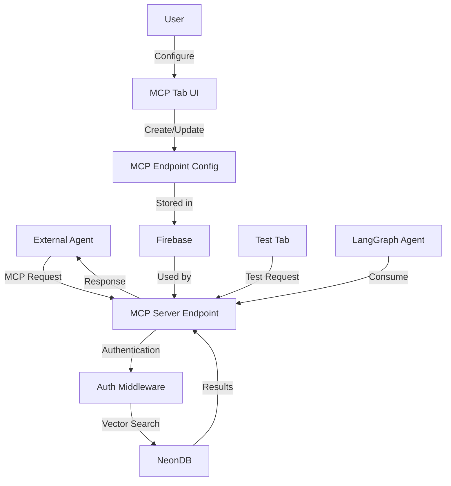

# MCP Server Endpoints for Vector Search

This feature allows external agents to access and search through collection documents via the Model Context Protocol (MCP).

## Overview

The MCP server endpoints provide a secure and controlled way to expose your collection's vector search functionality to external agents. This enables AI agents to search through your documents and retrieve relevant information based on semantic similarity.



## Features

- Create and manage MCP endpoints for your collections
- Secure endpoints with API key or bearer token authentication
- Configure rate limiting and IP restrictions
- Test endpoints directly from the UI
- Example LangGraph agent for consuming the endpoints

## Usage Instructions

### Creating and Testing an MCP Endpoint

1. Navigate to the Collections page
2. Select a collection
3. Go to the MCP tab
4. Create a new endpoint with a name, description, and authentication settings
5. Switch to the Test tab to test the endpoint with sample queries
6. Copy the endpoint URL and credentials for use in external applications

### Using the LangGraph Agent Test Script

1. Create a `.env.local` file in the project root with the required environment variables:

   ```
   # MCP Endpoint Configuration
   MCP_ENDPOINT_URL=http://localhost:3000/api/mcp/your-endpoint-id
   MCP_AUTH_TYPE=api_key  # or bearer_token
   MCP_AUTH_VALUE=your-api-key-or-bearer-token

   # OpenAI API Key for LangGraph Agent
   OPENAI_API_KEY=your-openai-api-key
   ```

2. Install the required dependencies:

   ```bash
   npm install dotenv @langchain/openai @langchain/langgraph @langchain/core langchain ts-node
   ```

3. Run the test script:

   ```bash
   npm run test-mcp-agent
   ```

4. Enter questions to test the agent's ability to search and retrieve information from your collection

## API Reference

### MCP Endpoint

**URL**: `/api/mcp/[endpointId]`

**Method**: `POST`

**Authentication**:

- API Key: Include the API key in the `x-api-key` header
- Bearer Token: Include the bearer token in the `Authorization` header as `Bearer <token>`

**Request Body**:

```json
{
  "query": "Your search query",
  "limit": 10 // Optional, default: 10
}
```

**Response**:

```json
{
  "success": true,
  "results": [
    {
      "id": 123,
      "document_id": "doc123",
      "user_id": "user456",
      "product_id": "prod789",
      "collection_id": "coll101",
      "chunk_index": 0,
      "total_chunks": 5,
      "chunk_content": "The content of the document chunk...",
      "filename": "example.pdf",
      "file_url": "https://example.com/files/example.pdf",
      "document_title": "Example Document",
      "collection_name": "Example Collection",
      "similarity": 0.92
    }
  ],
  "page": 1,
  "totalPages": 5,
  "totalResults": 42
}
```

## Security Considerations

- All endpoints require authentication (API key or bearer token)
- Rate limiting prevents abuse
- IP whitelisting provides an additional layer of security
- Credentials are stored securely in Firebase
- All requests are logged for audit purposes

## Implementation Details

The MCP server endpoints are implemented using the following components:

1. **Data Schema**: Extended collection schema to include MCP endpoint configuration
2. **Firebase Storage**: Store MCP endpoint configurations
3. **API Endpoint**: Handle MCP requests and perform vector search
4. **Authentication**: Verify API key or bearer token
5. **Rate Limiting**: Prevent abuse with request rate limiting
6. **Frontend Components**: UI for creating, managing, and testing endpoints
7. **LangGraph Agent**: Example script for consuming the endpoints

## Troubleshooting

- **Authentication Errors**: Verify that you're using the correct API key or bearer token
- **Rate Limiting**: Check if you've exceeded the configured rate limit
- **IP Restrictions**: Ensure your IP address is allowed if IP restrictions are enabled
- **Search Results**: If no results are returned, try a different search query or check if the collection is properly indexed
