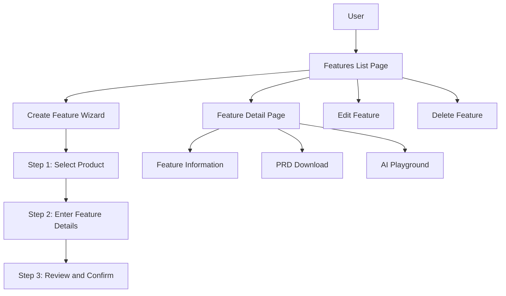

# Features Wizard Development Plan

After examining the existing codebase, I've developed a comprehensive plan for implementing the Features Wizard. This plan follows the same architectural patterns as the existing "My Stacks" feature while addressing the specific requirements for the new feature management system.

## 1. System Architecture Overview



## 2. Data Structure

We'll store features under the products collection following this structure:

```
products/[user_id]/products/[product_id]/features/[feature_id]
```

### Feature Schema

```typescript
export interface Feature {
  id?: string;
  name: string;
  description: string;
  status: "Active" | "Inactive" | "Under Development";
  tags: string[];
  productId: string;
  createdAt?: number;
  updatedAt?: number;
}

export const featureInputSchema = z.object({
  name: z.string().min(1, "Feature name is required"),
  description: z.string().min(1, "Description is required"),
  status: z.enum(["Active", "Inactive", "Under Development"]),
  tags: z.array(z.string()).default([]),
  productId: z.string().min(1, "Product ID is required"),
});

export type FeatureInput = z.infer<typeof featureInputSchema>;
```

## 3. Implementation Plan

### 3.1 Directory Structure

```
web/src/app/(protected)/myproducts/product/features/
├── page.tsx                    # Features list page
├── create/
│   ├── page.tsx                # Features wizard main page
│   └── components/
│       ├── step-indicator.tsx  # Reuse from mystacks
│       └── steps/
│           ├── product-step.tsx
│           ├── details-step.tsx
│           └── review-step.tsx
├── detail/
│   ├── page.tsx                # Feature detail page (no dynamic routes)
│   └── components/
│       ├── prd-download.tsx
│       └── ai-playground.tsx
└── components/
    ├── columns.tsx
    ├── feature-data-table.tsx
    ├── data-table-row-actions.tsx
    └── [other table components]
```

### 3.2 State Management

We'll use Jotai for state management, similar to the "My Stacks" feature:

```typescript
// Feature wizard state atoms
export const currentFeatureWizardStepAtom = atom<number>(1);
export const featureWizardStateAtom = atom<{
  productId: string;
  name: string;
  description: string;
  status: string;
  tags: string[];
}>({
  productId: "",
  name: "",
  description: "",
  status: "Under Development",
  tags: [],
});
export const selectedFeatureIdAtom = atom<string | null>(null);
export const isEditModeAtom = atom<boolean>(false);
export const selectedFeatureAtom = atom<Feature | null>(null);

// Table state atoms
export const featureTableColumnVisibilityAtom = atom<Record<string, boolean>>(
  {}
);
export const featureTableSortingAtom = atom<SortingState>([]);
export const featureTableRowSelectionAtom = atom<Record<string, boolean>>({});

// View preference atom
export const featureViewModeAtom = atom<"grid" | "table">("table");
```

### 3.3 React Server Actions

Instead of traditional API functions, we'll implement React Server Actions for all data operations:

```typescript
"use server";

import { revalidatePath } from "next/cache";
import { z } from "zod";
import { adminDb } from "@/lib/firebase/admin";
import { getCurrentUserId } from "@/lib/firebase/adminAuth";
import { getCurrentUnixTimestamp } from "@/utils/constants";
import { featureInputSchema } from "./schema";

// Create a new feature
export async function createFeature(data: z.infer<typeof featureInputSchema>) {
  try {
    // Validate input data
    const validatedData = featureInputSchema.parse(data);
    const userId = await getCurrentUserId();
    const featuresRef = getUserProductFeaturesRef(userId, data.productId);

    // Check for unique name within product
    const existingFeatures = await featuresRef
      .where("name", "==", data.name)
      .get();

    if (!existingFeatures.empty) {
      return {
        success: false,
        error: "A feature with this name already exists for this product",
      };
    }

    // Add timestamps
    const featureData = {
      ...validatedData,
      createdAt: getCurrentUnixTimestamp(),
      updatedAt: getCurrentUnixTimestamp(),
    };

    // Add to Firestore
    const docRef = await featuresRef.add(featureData);
    const featureId = docRef.id;

    // Revalidate relevant paths
    revalidatePath("/myproducts/product/features");

    return {
      success: true,
      id: featureId,
      data: featureData,
    };
  } catch (error) {
    console.error("Failed to create feature:", error);
    return {
      success: false,
      error: error instanceof Error ? error.message : String(error),
    };
  }
}

// Update an existing feature
export async function updateFeature(
  id: string,
  productId: string,
  data: Partial<z.infer<typeof featureInputSchema>>
) {
  try {
    const userId = await getCurrentUserId();
    const featuresRef = getUserProductFeaturesRef(userId, productId);

    // Check if feature exists
    const featureDoc = await featuresRef.doc(id).get();
    if (!featureDoc.exists) {
      return {
        success: false,
        error: "Feature not found",
      };
    }

    // If name is being updated, check for uniqueness
    if (data.name) {
      const existingFeatures = await featuresRef
        .where("name", "==", data.name)
        .get();

      const isDuplicate = existingFeatures.docs.some((doc) => doc.id !== id);
      if (isDuplicate) {
        return {
          success: false,
          error: "A feature with this name already exists for this product",
        };
      }
    }

    const updateData = {
      ...data,
      updatedAt: getCurrentUnixTimestamp(),
    };

    await featuresRef.doc(id).update(updateData);

    // Revalidate relevant paths
    revalidatePath("/myproducts/product/features");

    return {
      success: true,
      id,
      data: updateData,
    };
  } catch (error) {
    console.error(`Failed to update feature ${id}:`, error);
    return {
      success: false,
      error: error instanceof Error ? error.message : String(error),
    };
  }
}

// Delete a feature
export async function deleteFeature(id: string, productId: string) {
  try {
    const userId = await getCurrentUserId();
    const featuresRef = getUserProductFeaturesRef(userId, productId);

    // Check if feature exists
    const featureDoc = await featuresRef.doc(id).get();
    if (!featureDoc.exists) {
      return {
        success: false,
        error: "Feature not found",
      };
    }

    // Delete the feature
    await featuresRef.doc(id).delete();

    // Revalidate relevant paths
    revalidatePath("/myproducts/product/features");

    return {
      success: true,
      id,
    };
  } catch (error) {
    console.error(`Failed to delete feature ${id}:`, error);
    return {
      success: false,
      error: error instanceof Error ? error.message : String(error),
    };
  }
}

// Get all features for a product
export async function getProductFeatures(productId: string) {
  try {
    const userId = await getCurrentUserId();
    const featuresRef = getUserProductFeaturesRef(userId, productId);

    const snapshot = await featuresRef.orderBy("updatedAt", "desc").get();

    const features = snapshot.docs.map((doc) => ({
      id: doc.id,
      ...doc.data(),
    }));

    return {
      success: true,
      features,
    };
  } catch (error) {
    console.error("Failed to fetch features:", error);
    return {
      success: false,
      error: error instanceof Error ? error.message : String(error),
    };
  }
}

// Get a single feature by ID
export async function getFeature(id: string, productId: string) {
  try {
    const userId = await getCurrentUserId();
    const featuresRef = getUserProductFeaturesRef(userId, productId);

    const featureDoc = await featuresRef.doc(id).get();

    if (!featureDoc.exists) {
      return {
        success: false,
        error: "Feature not found",
      };
    }

    return {
      success: true,
      feature: {
        id: featureDoc.id,
        ...featureDoc.data(),
      },
    };
  } catch (error) {
    console.error(`Failed to fetch feature ${id}:`, error);
    return {
      success: false,
      error: error instanceof Error ? error.message : String(error),
    };
  }
}

// Helper function to get features reference
function getUserProductFeaturesRef(userId: string, productId: string) {
  return adminDb
    .collection("products")
    .doc(userId)
    .collection("products")
    .doc(productId)
    .collection("features");
}
```

## 4. UI Components

### 4.1 Features List Page

The Features List page will have:

1. Breadcrumb navigation
2. Toggle between grid and table views
3. Table view with TanStack Table:
   - Columns: Name, Description, Status, Tags, Actions
   - Filtering, sorting, and pagination
   - Row selection with "Delete Selected" button
   - Row actions: View, Edit, Delete
   - Table updates without re-rendering the entire table
4. Grid view with feature cards:
   - Feature name and description
   - Status indicator
   - Tags
   - Actions menu (View, Edit, Delete)

#### View Mode Toggle Implementation

We'll implement a toggle between grid and table views with persistence:

```typescript
"use client";

import { useAtom } from "jotai";
import { featureViewModeAtom } from "@/lib/store/feature-store";
import { useEffect } from "react";
import { Button } from "@/components/ui/button";
import { Grid2X2, List } from "lucide-react";

export function ViewModeToggle() {
  const [viewMode, setViewMode] = useAtom(featureViewModeAtom);

  // Load saved preference from localStorage on component mount
  useEffect(() => {
    const savedViewMode = localStorage.getItem("featureViewMode");
    if (savedViewMode === "grid" || savedViewMode === "table") {
      setViewMode(savedViewMode);
    }
  }, [setViewMode]);

  // Save preference to localStorage when it changes
  useEffect(() => {
    localStorage.setItem("featureViewMode", viewMode);
  }, [viewMode]);

  return (
    <div className="flex items-center space-x-2">
      <Button
        variant={viewMode === "grid" ? "default" : "outline"}
        size="sm"
        onClick={() => setViewMode("grid")}
        aria-label="Grid view"
      >
        <Grid2X2 className="h-4 w-4" />
      </Button>
      <Button
        variant={viewMode === "table" ? "default" : "outline"}
        size="sm"
        onClick={() => setViewMode("table")}
        aria-label="Table view"
      >
        <List className="h-4 w-4" />
      </Button>
    </div>
  );
}
```

### 4.2 Feature Creation Wizard

The wizard will have three steps:

1. **Step 1: Select Product**

   - Dropdown to select from user's products
   - Skip this step if coming from a product page

2. **Step 2: Enter Feature Details**

   - Feature name (with validation for uniqueness)
   - Description (with character limit)
   - Status dropdown
   - Tags input (using multi-tag component)

3. **Step 3: Review and Confirm**
   - Display all entered information
   - Option to go back and edit
   - Confirm button to create the feature

### 4.3 Feature Detail Page

The detail page will include:

1. Feature information display (using the selectedFeatureAtom)
2. PRD download button (Markdown format)
3. AI Playground with:
   - Current PRD on the left
   - Improved version on the right
   - Text area for user instructions
   - React Server Action for AI enhancement

#### PRD Download Implementation

We'll implement the PRD download functionality as follows:

```typescript
"use client";

import { Button } from "@/components/ui/button";
import { Download } from "lucide-react";
import { useAtom } from "jotai";
import { selectedFeatureAtom } from "@/lib/store/feature-store";
import { useState } from "react";
import { getProduct } from "@/lib/firebase/products";
import { getProductQuestions } from "@/lib/firebase/questions";
import { getProductNotes } from "@/lib/firebase/notes";

export function PrdDownload() {
  const [feature] = useAtom(selectedFeatureAtom);
  const [isGenerating, setIsGenerating] = useState(false);

  const handleDownload = async () => {
    if (!feature) return;

    setIsGenerating(true);

    try {
      // Fetch additional product context
      const productResult = await getProduct(feature.productId);
      const product = productResult.success ? productResult.product : null;

      // Fetch product questions
      const questionsResult = await getProductQuestions(feature.productId);
      const questions = questionsResult.success
        ? questionsResult.questions
        : [];

      // Fetch product notes
      const notesResult = await getProductNotes(feature.productId);
      const notes = notesResult.success ? notesResult.notes : [];

      // Generate PRD content
      const prdContent = generatePrdContent(feature, product, questions, notes);

      // Create a blob and download
      const blob = new Blob([prdContent], { type: "text/markdown" });
      const url = URL.createObjectURL(blob);
      const a = document.createElement("a");
      a.href = url;
      a.download = `${feature.name.replace(/\s+/g, "-").toLowerCase()}-prd.md`;
      document.body.appendChild(a);
      a.click();
      document.body.removeChild(a);
      URL.revokeObjectURL(url);
    } catch (error) {
      console.error("Failed to generate PRD:", error);
    } finally {
      setIsGenerating(false);
    }
  };

  return (
    <Button
      onClick={handleDownload}
      disabled={!feature || isGenerating}
      className="flex items-center gap-2"
    >
      <Download className="h-4 w-4" />
      {isGenerating ? "Generating..." : "Download PRD"}
    </Button>
  );
}

// Helper function to generate PRD content
function generatePrdContent(feature, product, questions, notes) {
  // Current date in YYYY-MM-DD format
  const date = new Date().toISOString().split("T")[0];

  // Extract relevant product information
  const productInfo = product
    ? {
        name: product.name,
        description: product.description || "",
        stage: product.stage || "",
        problem: product.problem || "",
      }
    : { name: "Unknown Product", description: "", stage: "", problem: "" };

  // Extract relevant questions and answers
  const relevantQA = questions
    .filter((q) => q.answer) // Only include answered questions
    .map((q) => `**${q.question}**\n${q.answer}`);

  // Extract relevant notes
  const relevantNotes = notes.map((note) => note.note_body).filter(Boolean);

  // Generate PRD content
  return `# ${feature.name} - Product Requirements Document
  
## Overview

**Date:** ${date}
**Status:** ${feature.status}
**Product:** ${productInfo.name}

## Summary

${feature.description}

${
  productInfo.description
    ? `\n### Product Context\n\n${productInfo.description}\n`
    : ""
}
${
  productInfo.problem
    ? `\n### Problem Statement\n\n${productInfo.problem}\n`
    : ""
}

## Feature Details

${feature.tags.length > 0 ? `**Tags:** ${feature.tags.join(", ")}\n` : ""}
${productInfo.stage ? `**Current Product Stage:** ${productInfo.stage}\n` : ""}

## Requirements

- TBD

## User Stories

- As a user, I want to...
- As an administrator, I need to...

## Acceptance Criteria

- TBD

## Technical Considerations

- TBD

${
  relevantQA.length > 0
    ? `\n## Related Questions & Answers\n\n${relevantQA.join("\n\n")}\n`
    : ""
}
${
  relevantNotes.length > 0
    ? `\n## Related Notes\n\n${relevantNotes.join("\n\n")}\n`
    : ""
}

## Timeline

- Planning: TBD
- Development: TBD
- Testing: TBD
- Release: TBD
`;
}
```

#### AI Playground Implementation

The AI Playground will be implemented as follows:

```typescript
"use server";

import { OpenAI } from "openai";
import { z } from "zod";
import { getProduct } from "@/lib/firebase/products";
import { getProductQuestions } from "@/lib/firebase/questions";
import { getProductNotes } from "@/lib/firebase/notes";

const enhancePrdSchema = z.object({
  featureId: z.string().min(1, "Feature ID is required"),
  productId: z.string().min(1, "Product ID is required"),
  currentPrd: z.string().min(1, "Current PRD is required"),
  instructions: z.string().optional(),
});

export async function enhancePrd(formData: FormData) {
  try {
    const featureId = formData.get("featureId") as string;
    const productId = formData.get("productId") as string;
    const currentPrd = formData.get("currentPrd") as string;
    const instructions = formData.get("instructions") as string;

    // Validate input
    const validatedData = enhancePrdSchema.parse({
      featureId,
      productId,
      currentPrd,
      instructions,
    });

    // Fetch additional product context
    const productResult = await getProduct(productId);
    const product = productResult.success ? productResult.product : null;

    // Fetch product questions
    const questionsResult = await getProductQuestions(productId);
    const questions = questionsResult.success ? questionsResult.questions : [];

    // Fetch product notes
    const notesResult = await getProductNotes(productId);
    const notes = notesResult.success ? notesResult.notes : [];

    // Initialize OpenAI client
    const openai = new OpenAI({
      apiKey: process.env.OPENAI_API_KEY,
    });

    // Create system prompt
    const systemPrompt = `You are an expert product requirements document (PRD) writer. 
    Your task is to enhance and improve the provided PRD content.
    Make the PRD more comprehensive, clear, and professional.
    Ensure it follows best practices for PRD structure and content.
    Maintain the original intent and core requirements while improving the presentation and clarity.
    
    Incorporate relevant information from the product context, questions, and notes provided, but do not overwhelm the PRD with generic information.
    Use the product context mainly in the summary section and when making specific suggestions.`;

    // Format product context
    let productContext = "";
    if (product) {
      productContext = `
      Product Name: ${product.name}
      Product Description: ${product.description || "N/A"}
      Product Stage: ${product.stage || "N/A"}
      Product Problem: ${product.problem || "N/A"}
      `;
    }

    // Format questions and answers
    const questionsContext = questions
      .filter((q) => q.answer) // Only include answered questions
      .map((q) => `Question: ${q.question}\nAnswer: ${q.answer}`)
      .join("\n\n");

    // Format notes
    const notesContext = notes
      .map((note, index) => `Note ${index + 1}: ${note.note_body}`)
      .join("\n\n");

    // Create user prompt
    const userPrompt = `Here is the current PRD content:
    
    ${validatedData.currentPrd}
    
    ${
      validatedData.instructions
        ? `Additional instructions: ${validatedData.instructions}`
        : ""
    }
    
    Here is additional context about the product:
    
    ${productContext}
    
    ${
      questionsContext
        ? `Here are relevant questions and answers about the product:\n\n${questionsContext}`
        : ""
    }
    
    ${
      notesContext
        ? `Here are relevant notes about the product:\n\n${notesContext}`
        : ""
    }
    
    Please enhance this PRD while maintaining its original intent and core requirements. Incorporate relevant information from the product context, questions, and notes, but do not overwhelm the PRD with generic information. Use the product context mainly in the summary section and when making specific suggestions.`;

    // Call OpenAI API
    const response = await openai.chat.completions.create({
      model: "gpt-4",
      messages: [
        { role: "system", content: systemPrompt },
        { role: "user", content: userPrompt },
      ],
      temperature: 0.7,
      max_tokens: 4000,
    });

    // Return the enhanced PRD
    return {
      success: true,
      enhancedPrd: response.choices[0].message.content,
    };
  } catch (error) {
    console.error("Failed to enhance PRD:", error);
    return {
      success: false,
      error: error instanceof Error ? error.message : String(error),
    };
  }
}
```

## 5. Navigation Integration

We'll add a "Features" button to the Product page in the right column, styled similarly to existing buttons for Questions and Assets.

## 6. Responsive Design

All components will be designed with responsive layouts to ensure they work well on mobile devices:

- Fluid layouts with appropriate max-width constraints
- Stack elements vertically on smaller screens
- Adjust font sizes and spacing for mobile
- Ensure touch targets are appropriately sized

## 7. Error Handling and Validation

We'll implement:

1. Form validation for all inputs
2. User-friendly error messages
3. Success toasts for create, edit, and delete operations
4. Logging for tracking feature creation events

## 8. Implementation Phases

### Phase 1: Core Structure and Data Layer

- Set up directory structure
- Create feature schema and React Server Actions
- Implement state management with Jotai

### Phase 2: Features List Page

- Implement table view with TanStack Table
- Create grid view with feature cards
- Add filtering, sorting, and pagination
- Ensure table updates without full re-renders

### Phase 3: Feature Creation Wizard

- Implement wizard steps
- Create form components with validation
- Add navigation between steps

### Phase 4: Feature Detail Page

- Create feature information display using selectedFeatureAtom
- Implement PRD download functionality
- Build AI Playground with React Server Action

### Phase 5: Integration and Polish

- Add "Features" button to Product page
- Implement responsive design
- Add error handling and success messages
- Test and refine the user experience

## 9. Technical Considerations

1. **Performance Optimization**

   - Implement pagination for features list
   - Optimize database queries
   - Use React.memo for complex components
   - Ensure table updates without re-rendering the entire table

2. **Security**

   - Ensure proper authentication for all server actions
   - Validate user permissions for each operation
   - Sanitize inputs to prevent XSS attacks

3. **Accessibility**
   - Use semantic HTML elements
   - Ensure proper keyboard navigation
   - Add ARIA attributes where needed
   - Test with screen readers

## 10. Testing Strategy

1. **API Tests (Integration)**

   - Test all React Server Actions
   - Test data validation and error handling
   - Test feature CRUD operations

2. **Playwright Functional Tests**

   - Test end-to-end user flows
   - Test feature creation wizard
   - Test feature list and detail pages
   - Test feature editing and deletion

3. **User Testing**
   - Test on different devices and browsers
   - Test with real users to gather feedback
