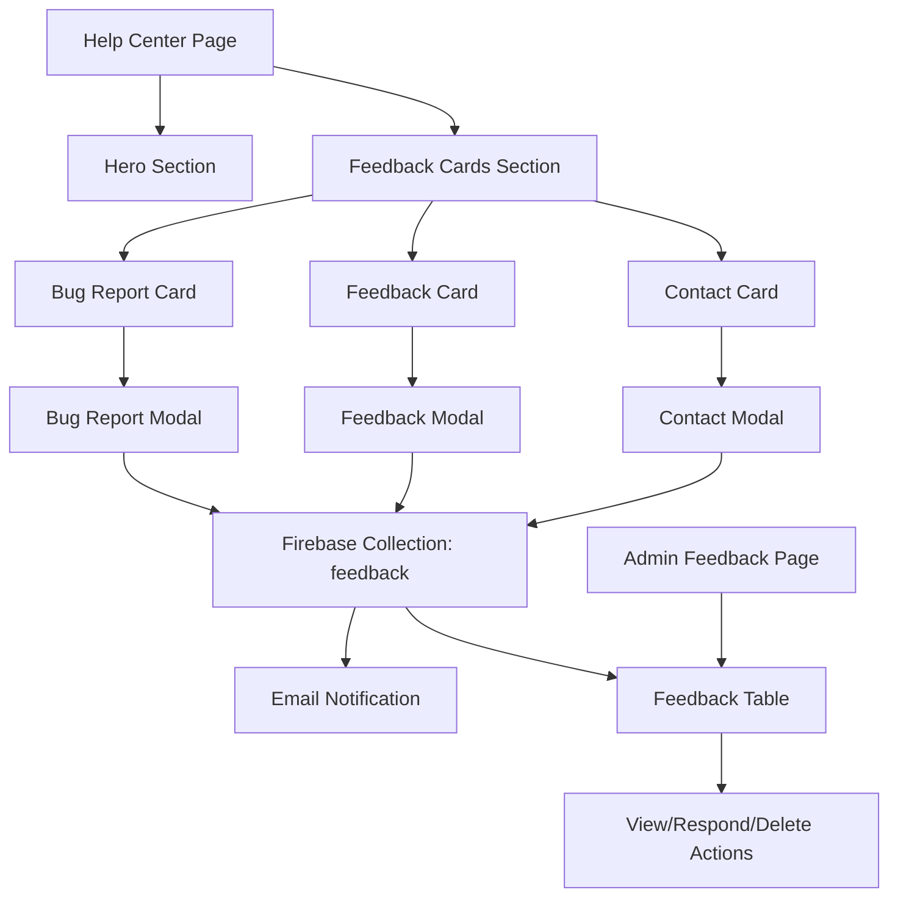

# Help Center Implementation Plan

## Overview

We need to create a comprehensive Help Center feature with the following components:

1. A new route `/help`
2. Connect the existing sidebar "Help Center" item to this route
3. Create a hero section with an image and heading
4. Add three colored cards for different types of feedback
5. Create modals with forms for each card type
6. Set up Firebase to store the feedback
7. Create an admin route to review and respond to feedback
8. Send email notifications to admin when feedback is submitted

## Technical Architecture



## Implementation Steps

### 1. Create Firebase Schema for Feedback

We'll need to define a schema for the feedback collection in Firebase:

```typescript
// Feedback schema
export interface Feedback {
  id: string;
  userId: string;
  userEmail: string;
  name: string;
  type: "bug" | "feature" | "comment";
  subject: string;
  body: string;
  status: "new" | "in-progress" | "resolved";
  createdAt: string;
  updatedAt: string;
  response?: string;
  responseAt?: string;
}

export const feedbackSchema = z.object({
  name: z.string().min(1, "Name is required"),
  type: z.enum(["bug", "feature", "comment"]),
  subject: z.string().min(1, "Subject is required"),
  body: z.string().min(1, "Message is required"),
});

export type FeedbackInput = z.infer<typeof feedbackSchema>;
```

### 2. Create Firebase Service Functions

We'll need to create server functions to interact with the feedback collection:

```typescript
// Functions to create, get, update, and delete feedback
export async function createFeedback(
  data: FeedbackInput,
  userId: string,
  userEmail: string
) {
  try {
    // Validate input data
    const validatedData = feedbackSchema.parse(data);

    // Create a reference to the feedback collection
    const feedbackRef = adminDb.collection("feedback");

    // Generate a unique ID for the feedback
    const feedbackId = uuidv4();

    // Add timestamps
    const now = new Date().toISOString();

    const feedbackData = {
      ...validatedData,
      id: feedbackId,
      userId,
      userEmail,
      status: "new",
      createdAt: now,
      updatedAt: now,
    };

    // Add to Firestore
    await feedbackRef.doc(feedbackId).set(feedbackData);

    // Send email notification to admin
    await sendFeedbackNotificationEmail(feedbackData);

    return {
      success: true,
      id: feedbackId,
      data: feedbackData,
    };
  } catch (error) {
    console.error("Failed to create feedback:", error);
    return {
      success: false,
      error: error instanceof Error ? error.message : String(error),
    };
  }
}

export async function getAllFeedback() {
  // Implementation
}

export async function getFeedback(id: string) {
  // Implementation
}

export async function updateFeedback(id: string, data: Partial<FeedbackInput>) {
  // Implementation
}

export async function deleteFeedback(id: string) {
  // Implementation
}

export async function respondToFeedback(id: string, response: string) {
  // Implementation
}
```

### 3. Create Email Notification Template

Create a React-based email template for feedback notifications:

```tsx
// web/src/lib/emails/feedback-notification.tsx
import * as React from "react";
import { Feedback } from "@/lib/firebase/schema";

interface FeedbackNotificationProps {
  feedback: Feedback;
}

export default function FeedbackNotification({
  feedback,
}: FeedbackNotificationProps) {
  return (
    <div>
      <h1>New Feedback Submitted</h1>
      <p>
        A new {feedback.type} has been submitted by {feedback.name} (
        {feedback.userEmail}).
      </p>
      <div style={{ marginTop: "20px", marginBottom: "20px" }}>
        <h2>Feedback Details</h2>
        <table
          style={{
            width: "100%",
            borderCollapse: "collapse",
            marginTop: "10px",
          }}
        >
          <tbody>
            <tr>
              <td
                style={{
                  padding: "8px",
                  border: "1px solid #ddd",
                  fontWeight: "bold",
                }}
              >
                Type
              </td>
              <td style={{ padding: "8px", border: "1px solid #ddd" }}>
                {feedback.type.charAt(0).toUpperCase() + feedback.type.slice(1)}
              </td>
            </tr>
            <tr>
              <td
                style={{
                  padding: "8px",
                  border: "1px solid #ddd",
                  fontWeight: "bold",
                }}
              >
                Subject
              </td>
              <td style={{ padding: "8px", border: "1px solid #ddd" }}>
                {feedback.subject}
              </td>
            </tr>
            <tr>
              <td
                style={{
                  padding: "8px",
                  border: "1px solid #ddd",
                  fontWeight: "bold",
                }}
              >
                Message
              </td>
              <td style={{ padding: "8px", border: "1px solid #ddd" }}>
                {feedback.body}
              </td>
            </tr>
          </tbody>
        </table>
      </div>
      <div style={{ marginTop: "20px" }}>
        <p>
          <a
            href={`${process.env.NEXT_PUBLIC_APP_URL}/admin/feedback`}
            style={{
              display: "inline-block",
              backgroundColor: "#4f46e5",
              color: "white",
              fontWeight: "bold",
              padding: "12px 20px",
              borderRadius: "6px",
              textDecoration: "none",
            }}
          >
            View in Admin Panel
          </a>
        </p>
      </div>
      <hr style={{ marginTop: "40px", marginBottom: "20px" }} />
      <div style={{ fontSize: "12px", color: "#666" }}>
        <p>
          &copy; {new Date().getFullYear()} LaunchpadAI. All rights reserved.
        </p>
      </div>
    </div>
  );
}
```

### 4. Create Email Sending Function

```typescript
// web/src/lib/firebase/feedback.ts (additional function)
import { Resend } from "resend";
import FeedbackNotification from "@/lib/emails/feedback-notification";

// Initialize Resend with API key from environment variables
const resend = new Resend(process.env.RESEND_API_KEY);

export async function sendFeedbackNotificationEmail(feedback: Feedback) {
  try {
    await resend.emails.send({
      from: process.env.EMAIL_FROM || "notifications@launchpadai.io",
      to: process.env.EMAIL_ADMIN || "admin@launchpadai.io",
      subject: `New ${feedback.type} from ${feedback.name}`,
      react: FeedbackNotification({ feedback }),
    });
    console.log(
      `Admin notification email sent for new feedback: ${feedback.id}`
    );
    return true;
  } catch (emailError) {
    // Log error but don't fail the feedback submission process
    console.error("Error sending admin notification email:", emailError);
    return false;
  }
}
```

### 5. Create Data Management with Tanstack Query

Create custom hooks for feedback operations using Tanstack Query:

```typescript
// web/src/hooks/useFeedback.ts
import { useMutation, useQuery, useQueryClient } from "@tanstack/react-query";
import {
  createFeedback,
  getAllFeedback,
  getFeedback,
  updateFeedback,
  deleteFeedback,
  respondToFeedback,
} from "@/lib/firebase/feedback";
import { FeedbackInput } from "@/lib/firebase/schema";
import { useToast } from "@/hooks/use-toast";
import { TOAST_DEFAULT_DURATION } from "@/utils/constants";

// Hook for fetching all feedback
export function useAllFeedback() {
  const { toast } = useToast();

  return useQuery({
    queryKey: ["feedback"],
    queryFn: async () => {
      const result = await getAllFeedback();
      if (!result.success) {
        toast({
          title: "Error",
          description: result.error || "Failed to load feedback",
          variant: "destructive",
          duration: TOAST_DEFAULT_DURATION,
        });
        return [];
      }
      return result.feedback || [];
    },
  });
}

// Hook for fetching a single feedback item
export function useFeedbackItem(id: string) {
  const { toast } = useToast();

  return useQuery({
    queryKey: ["feedback", id],
    queryFn: async () => {
      const result = await getFeedback(id);
      if (!result.success) {
        toast({
          title: "Error",
          description: result.error || "Failed to load feedback item",
          variant: "destructive",
          duration: TOAST_DEFAULT_DURATION,
        });
        return null;
      }
      return result.feedback;
    },
    enabled: !!id,
  });
}

// Hook for creating feedback
export function useCreateFeedback() {
  const queryClient = useQueryClient();
  const { toast } = useToast();

  return useMutation({
    mutationFn: async ({
      data,
      userId,
      userEmail,
    }: {
      data: FeedbackInput;
      userId: string;
      userEmail: string;
    }) => {
      return await createFeedback(data, userId, userEmail);
    },
    onSuccess: (result) => {
      if (result.success) {
        queryClient.invalidateQueries({ queryKey: ["feedback"] });
        toast({
          title: "Feedback submitted",
          description: "Thank you for your feedback!",
          duration: TOAST_DEFAULT_DURATION,
        });
      } else {
        toast({
          title: "Error",
          description: result.error || "Failed to submit feedback",
          variant: "destructive",
          duration: TOAST_DEFAULT_DURATION,
        });
      }
      return result;
    },
    onError: (error) => {
      toast({
        title: "Error",
        description:
          error instanceof Error ? error.message : "An error occurred",
        variant: "destructive",
        duration: TOAST_DEFAULT_DURATION,
      });
    },
  });
}

// Additional hooks for updating, responding to, and deleting feedback
```

### 6. Create Help Center Page

Create a new page at `/app/(protected)/help/page.tsx` with:

- Hero section with image and heading
- Three colored cards for different feedback types
- Modal triggers for each card

```tsx
// web/src/app/(protected)/help/page.tsx
"use client";

import { useState } from "react";
import { HelpHero } from "./components/help-hero";
import { FeedbackCards } from "./components/feedback-cards";
import { FeedbackModal } from "./components/feedback-modal";
import { useCreateFeedback } from "@/hooks/useFeedback";
import { useAuth } from "@/hooks/useAuth"; // Assuming this hook exists to get user info

export default function HelpPage() {
  const [modalOpen, setModalOpen] = useState(false);
  const [feedbackType, setFeedbackType] = useState<
    "bug" | "feature" | "comment"
  >("bug");

  const { user } = useAuth();
  const createFeedbackMutation = useCreateFeedback();

  const handleOpenModal = (type: "bug" | "feature" | "comment") => {
    setFeedbackType(type);
    setModalOpen(true);
  };

  const handleSubmitFeedback = async (data) => {
    if (!user) {
      // Handle not logged in case
      return;
    }

    await createFeedbackMutation.mutateAsync({
      data,
      userId: user.uid,
      userEmail: user.email || "",
    });

    setModalOpen(false);
  };

  return (
    <div className="container mx-auto py-8">
      <HelpHero />
      <FeedbackCards onCardClick={handleOpenModal} />
      <FeedbackModal
        open={modalOpen}
        onOpenChange={setModalOpen}
        type={feedbackType}
        onSubmit={handleSubmitFeedback}
        isSubmitting={createFeedbackMutation.isPending}
      />
    </div>
  );
}
```

### 7. Create Help Center Components

#### Hero Component

```tsx
// web/src/app/(protected)/help/components/help-hero.tsx
import Image from "next/image";

export function HelpHero() {
  return (
    <div className="relative rounded-lg overflow-hidden mb-12">
      <div className="absolute inset-0 z-0">
        <Image
          src="/images/help-center-hero.jpg" // We'll need to add this image
          alt="Help Center"
          fill
          className="object-cover"
          priority
        />
        <div className="absolute inset-0 bg-gradient-to-r from-primary/80 to-primary/40" />
      </div>

      <div className="relative z-10 px-6 py-16 md:py-24 text-white">
        <h1 className="text-3xl md:text-4xl lg:text-5xl font-bold mb-4">
          We're Here to Help
        </h1>
        <p className="text-lg md:text-xl max-w-2xl">
          Our platform is actively being developed. We value your feedback and
          are here to assist you with any questions or issues you may encounter.
        </p>
      </div>
    </div>
  );
}
```

#### Feedback Cards Component

```tsx
// web/src/app/(protected)/help/components/feedback-cards.tsx
import { Bug, MessageSquare, HelpCircle } from "lucide-react";
import { Button } from "@/components/ui/button";

interface FeedbackCardsProps {
  onCardClick: (type: "bug" | "feature" | "comment") => void;
}

export function FeedbackCards({ onCardClick }: FeedbackCardsProps) {
  return (
    <div className="grid grid-cols-1 md:grid-cols-3 gap-6">
      {/* Bug Report Card */}
      <div className="border-2 border-red-200 rounded-lg p-6 hover:shadow-md transition-shadow">
        <div className="flex flex-col items-center text-center">
          <div className="bg-red-100 p-3 rounded-full mb-4">
            <Bug className="h-8 w-8 text-red-500" />
          </div>
          <h3 className="text-xl font-semibold mb-2">Submit a Bug Report</h3>
          <p className="text-muted-foreground mb-6">
            Found something that's not working correctly? Let us know so we can
            fix it.
          </p>
          <Button
            onClick={() => onCardClick("bug")}
            variant="outline"
            className="border-red-200 text-red-600 hover:bg-red-50"
          >
            Report Bug
          </Button>
        </div>
      </div>

      {/* Feature Request Card */}
      <div className="border-2 border-blue-200 rounded-lg p-6 hover:shadow-md transition-shadow">
        <div className="flex flex-col items-center text-center">
          <div className="bg-blue-100 p-3 rounded-full mb-4">
            <MessageSquare className="h-8 w-8 text-blue-500" />
          </div>
          <h3 className="text-xl font-semibold mb-2">Submit Feedback</h3>
          <p className="text-muted-foreground mb-6">
            Have ideas for new features or improvements? We'd love to hear your
            suggestions.
          </p>
          <Button
            onClick={() => onCardClick("feature")}
            variant="outline"
            className="border-blue-200 text-blue-600 hover:bg-blue-50"
          >
            Submit Feedback
          </Button>
        </div>
      </div>

      {/* Contact Card */}
      <div className="border-2 border-green-200 rounded-lg p-6 hover:shadow-md transition-shadow">
        <div className="flex flex-col items-center text-center">
          <div className="bg-green-100 p-3 rounded-full mb-4">
            <HelpCircle className="h-8 w-8 text-green-500" />
          </div>
          <h3 className="text-xl font-semibold mb-2">Get in Touch</h3>
          <p className="text-muted-foreground mb-6">
            Have questions or need assistance? Our team is here to help you.
          </p>
          <Button
            onClick={() => onCardClick("comment")}
            variant="outline"
            className="border-green-200 text-green-600 hover:bg-green-50"
          >
            Contact Us
          </Button>
        </div>
      </div>
    </div>
  );
}
```

#### Feedback Modal Component

```tsx
// web/src/app/(protected)/help/components/feedback-modal.tsx
import { useState, useEffect } from "react";
import { useForm } from "react-hook-form";
import { zodResolver } from "@hookform/resolvers/zod";
import { z } from "zod";
import { useAuth } from "@/hooks/useAuth";
import {
  Dialog,
  DialogContent,
  DialogDescription,
  DialogFooter,
  DialogHeader,
  DialogTitle,
} from "@/components/ui/dialog";
import {
  Form,
  FormControl,
  FormField,
  FormItem,
  FormLabel,
  FormMessage,
} from "@/components/ui/form";
import { Input } from "@/components/ui/input";
import { Button } from "@/components/ui/button";
import { Textarea } from "@/components/ui/textarea";
import {
  Select,
  SelectContent,
  SelectItem,
  SelectTrigger,
  SelectValue,
} from "@/components/ui/select";

const feedbackFormSchema = z.object({
  name: z.string().min(1, "Name is required"),
  type: z.enum(["bug", "feature", "comment"], {
    required_error: "Please select a feedback type",
  }),
  subject: z.string().min(1, "Subject is required"),
  body: z.string().min(1, "Message is required"),
});

type FeedbackFormValues = z.infer<typeof feedbackFormSchema>;

interface FeedbackModalProps {
  open: boolean;
  onOpenChange: (open: boolean) => void;
  type: "bug" | "feature" | "comment";
  onSubmit: (data: FeedbackFormValues) => Promise<void>;
  isSubmitting: boolean;
}

export function FeedbackModal({
  open,
  onOpenChange,
  type,
  onSubmit,
  isSubmitting,
}: FeedbackModalProps) {
  const { user } = useAuth();

  const form = useForm<FeedbackFormValues>({
    resolver: zodResolver(feedbackFormSchema),
    defaultValues: {
      name: user?.displayName || "",
      type: type,
      subject: "",
      body: "",
    },
  });

  // Update form values when type changes
  useEffect(() => {
    form.setValue("type", type);
  }, [type, form]);

  // Update name when user changes
  useEffect(() => {
    if (user?.displayName) {
      form.setValue("name", user.displayName);
    }
  }, [user, form]);

  const handleSubmit = async (data: FeedbackFormValues) => {
    await onSubmit(data);
    form.reset();
  };

  const getModalTitle = () => {
    switch (type) {
      case "bug":
        return "Report a Bug";
      case "feature":
        return "Submit Feedback";
      case "comment":
        return "Contact Us";
      default:
        return "Submit Feedback";
    }
  };

  return (
    <Dialog open={open} onOpenChange={onOpenChange}>
      <DialogContent className="sm:max-w-[500px]">
        <DialogHeader>
          <DialogTitle>{getModalTitle()}</DialogTitle>
          <DialogDescription>
            Fill out the form below to submit your{" "}
            {type === "bug"
              ? "bug report"
              : type === "feature"
              ? "feedback"
              : "message"}
            .
          </DialogDescription>
        </DialogHeader>

        <Form {...form}>
          <form
            onSubmit={form.handleSubmit(handleSubmit)}
            className="space-y-4"
          >
            <FormField
              control={form.control}
              name="name"
              render={({ field }) => (
                <FormItem>
                  <FormLabel>Name</FormLabel>
                  <FormControl>
                    <Input {...field} />
                  </FormControl>
                  <FormMessage />
                </FormItem>
              )}
            />

            <FormField
              control={form.control}
              name="type"
              render={({ field }) => (
                <FormItem>
                  <FormLabel>Type</FormLabel>
                  <Select
                    onValueChange={field.onChange}
                    defaultValue={field.value}
                  >
                    <FormControl>
                      <SelectTrigger>
                        <SelectValue placeholder="Select a type" />
                      </SelectTrigger>
                    </FormControl>
                    <SelectContent>
                      <SelectItem value="bug">Bug Report</SelectItem>
                      <SelectItem value="feature">Feature Request</SelectItem>
                      <SelectItem value="comment">General Comment</SelectItem>
                    </SelectContent>
                  </Select>
                  <FormMessage />
                </FormItem>
              )}
            />

            <FormField
              control={form.control}
              name="subject"
              render={({ field }) => (
                <FormItem>
                  <FormLabel>Subject</FormLabel>
                  <FormControl>
                    <Input {...field} />
                  </FormControl>
                  <FormMessage />
                </FormItem>
              )}
            />

            <FormField
              control={form.control}
              name="body"
              render={({ field }) => (
                <FormItem>
                  <FormLabel>Message</FormLabel>
                  <FormControl>
                    <Textarea
                      {...field}
                      className="min-h-[120px]"
                      placeholder="Please provide details..."
                    />
                  </FormControl>
                  <FormMessage />
                </FormItem>
              )}
            />

            <DialogFooter>
              <Button
                type="button"
                variant="outline"
                onClick={() => onOpenChange(false)}
                disabled={isSubmitting}
              >
                Cancel
              </Button>
              <Button type="submit" disabled={isSubmitting}>
                {isSubmitting ? "Submitting..." : "Submit"}
              </Button>
            </DialogFooter>
          </form>
        </Form>
      </DialogContent>
    </Dialog>
  );
}
```

### 8. Create Admin Feedback Page

Create a new page at `/app/(protected)/admin/feedback/page.tsx` with:

- Tanstack table similar to the courses table
- Filters for feedback type and status
- Actions for viewing, responding to, and deleting feedback

```tsx
// web/src/app/(protected)/admin/feedback/page.tsx
"use client";

import { useState } from "react";
import { useAllFeedback, useBulkDeleteFeedback } from "@/hooks/useFeedback";
import { columns } from "./components/feedback-columns";
import { FeedbackTable } from "./components/feedback-table";
import { Breadcrumbs } from "@/components/breadcrumbs";
import { Button } from "@/components/ui/button";
import { Trash } from "lucide-react";
import {
  AlertDialog,
  AlertDialogAction,
  AlertDialogCancel,
  AlertDialogContent,
  AlertDialogDescription,
  AlertDialogFooter,
  AlertDialogHeader,
  AlertDialogTitle,
} from "@/components/ui/alert-dialog";
import { useAtom } from "jotai";
import { rowSelectionAtom } from "@/lib/store/feedback-store"; // We'll need to create this

export default function FeedbackPage() {
  const { data: feedback = [], isLoading } = useAllFeedback();
  const bulkDeleteMutation = useBulkDeleteFeedback();
  const [deleteDialogOpen, setDeleteDialogOpen] = useState(false);
  const [rowSelection, setRowSelection] = useAtom(rowSelectionAtom);

  // Get selected feedback IDs
  const selectedRowIndexes = Object.keys(rowSelection).filter(
    (id) => rowSelection[id]
  );
  const hasSelectedItems = selectedRowIndexes.length > 0;

  // Handle deleting selected feedback
  const handleDeleteSelected = async () => {
    // Map row indexes to actual feedback IDs
    const selectedFeedbackIds = selectedRowIndexes
      .map((index) => {
        const numericIndex = parseInt(index, 10);
        return feedback[numericIndex]?.id;
      })
      .filter(Boolean) as string[];

    await bulkDeleteMutation.mutateAsync(selectedFeedbackIds);
    setRowSelection({});
    setDeleteDialogOpen(false);
  };

  return (
    <div>
      <Breadcrumbs
        items={[
          { label: "Admin", href: "/admin" },
          { label: "Feedback", href: "", isCurrentPage: true },
        ]}
      />

      <div className="mt-8 mb-2 flex flex-wrap items-center justify-between gap-2">
        <div>
          <h2 className="text-2xl font-bold tracking-tight">Feedback</h2>
          <p className="text-muted-foreground">
            Manage user feedback, bug reports, and contact requests
          </p>
        </div>
        {feedback.length > 0 && hasSelectedItems && (
          <Button
            variant="outline"
            onClick={() => setDeleteDialogOpen(true)}
            disabled={bulkDeleteMutation.isPending}
            className="text-red-500 border-red-200 hover:bg-red-50 hover:text-red-600"
          >
            <Trash className="mr-2 h-4 w-4" />
            Delete Selected
          </Button>
        )}
      </div>

      <div className="-mx-4 mt-4 flex-1 overflow-auto px-4 py-1">
        {isLoading ? (
          <div className="flex items-center justify-center h-64">
            <p className="text-muted-foreground">Loading feedback...</p>
          </div>
        ) : feedback.length > 0 ? (
          <FeedbackTable columns={columns} data={feedback} />
        ) : (
          <EmptyState />
        )}
      </div>

      {/* Delete confirmation dialog */}
      <AlertDialog open={deleteDialogOpen} onOpenChange={setDeleteDialogOpen}>
        <AlertDialogContent>
          <AlertDialogHeader>
            <AlertDialogTitle>Delete Selected Feedback</AlertDialogTitle>
            <AlertDialogDescription>
              Are you sure you want to delete {selectedRowIndexes.length}{" "}
              selected {selectedRowIndexes.length === 1 ? "item" : "items"}?
              This action cannot be undone.
            </AlertDialogDescription>
          </AlertDialogHeader>
          <AlertDialogFooter>
            <AlertDialogCancel disabled={bulkDeleteMutation.isPending}>
              Cancel
            </AlertDialogCancel>
            <AlertDialogAction
              onClick={(e) => {
                e.preventDefault();
                handleDeleteSelected();
              }}
              disabled={bulkDeleteMutation.isPending}
              className="bg-red-500 hover:bg-red-600"
            >
              {bulkDeleteMutation.isPending ? "Deleting..." : "Delete"}
            </AlertDialogAction>
          </AlertDialogFooter>
        </AlertDialogContent>
      </AlertDialog>
    </div>
  );
}
```

### 9. Create Feedback Table Components

Similar to the courses table, we'll need:

- Columns definition
- Row actions
- Filters
- Pagination

These components will follow the same pattern as the existing courses table components.

## UI Design

### Help Center Hero Section

- Background image with overlay
- Heading: "We're Here to Help"
- Subheading: "Our platform is actively being developed. We value your feedback and are here to assist you."

### Feedback Cards

- Three cards with different border colors:
  - Bug Report: Red border
  - Feedback: Blue border
  - Contact: Green border
- Icons for each type
- Brief description of each type
- Button to open the corresponding modal

### Feedback Form

- Name field (prefilled with user's name)
- Type dropdown (prefilled based on card selection)
- Subject field
- Body field (textarea)
- Submit button

### Admin Feedback Table

- Columns: ID, Type, Subject, User, Date, Status, Actions
- Filters for Type and Status
- Pagination
- Row selection for bulk actions
- Action menu with View, Respond, Delete options

## Timeline

1. **Day 1**:

   - Set up Firebase schema and service functions
   - Create Tanstack Query hooks for feedback operations
   - Create email notification template

2. **Day 1-2**:

   - Create Help Center page with hero and cards
   - Implement feedback store with Jotai atoms

3. **Day 2-3**:

   - Implement feedback modals and forms
   - Connect forms to Tanstack Query mutations

4. **Day 3-4**:

   - Create admin feedback page with table
   - Implement Tanstack Query for data fetching and caching

5. **Day 4-5**:

   - Implement feedback actions (view, respond, delete) with mutations
   - Add optimistic updates for better UX

6. **Day 5**:
   - Testing and refinement
   - Add loading states and error handling
