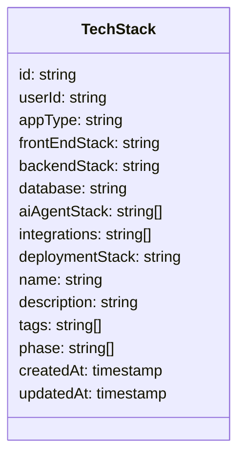

# Tech Stack Wizard Implementation Plan

## 1. System Architecture

```mermaid
graph TD
    A[User] --> B[/techstack Route]
    B --> C[TechStackWizard Component]
    C --> D[Step Components]
    D --> E[Jotai State Management]
    E --> F[Firebase Storage]

    G[/mystacks Route] --> H[TechStackList Component]
    H --> I[Card/Table Views]
    H --> J[Filtering & Search]

    K[/mystacks/stack Route] --> L[TechStack Detail Page]
    L --> M[Download Assets]

    F --> H
    F --> L
```

## 2. Data Model



## 3. Implementation Components

### 3.1. State Management with Jotai

We'll create a new file `web/src/lib/store/techstack-store.ts` to manage the state for the tech stack wizard and list views:

```typescript
// Key atoms to implement:
- techStackLayoutViewAtom: For toggling between card and table views
- allTechStacksAtom: For storing all tech stacks
- techStackPhaseFilterAtom: For filtering by phase
- techStackSearchQueryAtom: For search functionality
- filteredTechStacksAtom: Derived atom for filtered tech stacks
- selectedTechStackAtom: For the currently selected tech stack
- techStackWizardStateAtom: For the wizard form state
- currentWizardStepAtom: For tracking the current step in the wizard
```

### 3.2. Firebase Schema and CRUD Operations

We'll extend the Firebase schema in `web/src/lib/firebase/schema.ts` to include the tech stack model and create a new file `web/src/lib/firebase/techstacks.ts` for CRUD operations:

```typescript
// Key functions to implement:
- createTechStack(): Create a new tech stack
- getAllTechStacks(): Get all tech stacks for the current user
- getTechStack(): Get a single tech stack by ID
- updateTechStack(): Update an existing tech stack
- deleteTechStack(): Delete a tech stack
```

### 3.3. Tech Stack Wizard Components

#### 3.3.1. Main Wizard Component

Create `web/src/app/(protected)/techstack/page.tsx` as the main wizard component:

```typescript
// Key features:
- 9-step wizard with progress indicator
- Navigation between steps with validation
- Form submission to Firebase
- Responsive design using shadcn components
```

#### 3.3.2. Step Components

Create individual components for each step in `web/src/app/(protected)/techstack/components/steps/`:

1. **App Type Step** (`app-type-step.tsx`)

   - Options: Full-stack web app, Mobile app, AI Agent
   - "Other" option with text input

2. **Front End Step** (`frontend-step.tsx`)

   - Options: React/NextJS, Flask/Django, Angular, Vue.js
   - "Other" option with text input

3. **Backend Step** (`backend-step.tsx`)

   - Options: Node/NextJS, Python, Dotnet, Ruby on Rails
   - "Other" option with text input

4. **Database Step** (`database-step.tsx`)

   - Options: Relational, NoSQL, Hybrid
   - "Other" option with text input

5. **AI Agent Step** (`ai-agent-step.tsx`)

   - Options: LangChain/Graph, Autogen, PydanticAI
   - Multi-select with "Other" option

6. **Integrations Step** (`integrations-step.tsx`)

   - Options: Payments, Email, APIs
   - Multi-select with "Other" option

7. **Deployment Step** (`deployment-step.tsx`)

   - Options: Vercel, AWS, Azure, GCP, Digital Ocean
   - "Other" option with text input

8. **App Details Step** (`app-details-step.tsx`)

   - Form with fields: Name, Description, Tags, Phase (multi-select)

9. **Review Step** (`review-step.tsx`)
   - Summary of all selections
   - Create Stack button

### 3.4. Tech Stack List Page

Create `web/src/app/(protected)/mystacks/page.tsx` to display the user's tech stacks:

```typescript
// Key features:
- Toggle between card and table views
- Search functionality
- Phase filtering
- Create new tech stack button
```

#### 3.4.1. Card and Table Components

Create components for displaying tech stacks in card and table views:

- `web/src/app/(protected)/mystacks/components/tech-stack-card.tsx`
- `web/src/app/(protected)/mystacks/components/tech-stack-table.tsx`

### 3.5. Tech Stack Detail Page

Create `web/src/app/(protected)/mystacks/stack/page.tsx` for viewing a single tech stack:

```typescript
// Key features:
- Display tech stack details
- Download assets button
- Edit and delete functionality
```

## 4. Implementation Steps

1. **Set up state management**

   - Create Jotai atoms for tech stack state
   - Implement derived atoms for filtering

2. **Extend Firebase schema**

   - Add TechStack interface to schema
   - Create CRUD operations for tech stacks

3. **Implement wizard components**

   - Create main wizard component
   - Implement individual step components
   - Add validation and navigation

4. **Implement tech stack list page**

   - Create list page with card and table views
   - Implement filtering and search
   - Add create, edit, and delete functionality

5. **Implement tech stack detail page**

   - Create detail page with tech stack information
   - Add download assets functionality

6. **Testing and refinement**
   - Test all functionality
   - Ensure responsive design
   - Optimize performance

## 5. Component Structure

```
web/src/
├── app/
│   └── (protected)/
│       ├── techstack/
│       │   ├── page.tsx
│       │   └── components/
│       │       └── steps/
│       │           ├── app-type-step.tsx
│       │           ├── frontend-step.tsx
│       │           ├── backend-step.tsx
│       │           ├── database-step.tsx
│       │           ├── ai-agent-step.tsx
│       │           ├── integrations-step.tsx
│       │           ├── deployment-step.tsx
│       │           ├── app-details-step.tsx
│       │           └── review-step.tsx
│       ├── mystacks/
│       │   ├── page.tsx
│       │   ├── components/
│       │   │   ├── tech-stack-card.tsx
│       │   │   └── tech-stack-table.tsx
│       │   └── stack/
│       │       └── page.tsx
│       └── download_assets/
│           └── tech-stack-assets.tsx
├── lib/
│   ├── firebase/
│   │   ├── schema.ts (extended)
│   │   └── techstacks.ts (new)
│   └── store/
│       └── techstack-store.ts (new)
└── components/
    └── techstack/
        ├── phase-filter.tsx
        └── tech-option.tsx
```

## 6. UI Design

### 6.1. Wizard Steps

Each step will follow a consistent design pattern:

- Title and description at the top
- Large radio button boxes for single-select options
- Checkbox groups for multi-select options
- "Other" option with text input for custom entries
- Back and Next buttons at the bottom

### 6.2. Tech Stack List

- Toggle between card and table views
- Filter by phase using pills
- Search functionality
- Create new tech stack button
- Cards show key information with edit and delete options

### 6.3. Tech Stack Detail

- Display all tech stack information
- Download assets button
- Edit and delete buttons

## 7. Validation Rules

- App Type: Ensure a selection is made
- Front End Stack: Ensure a selection is made
- Backend Stack: Ensure a selection is made
- Database: Ensure a selection is made
- AI Agent Stack: Ensure at least one option is selected
- Integrations: Ensure at least one option is selected
- Deployment Stack: Ensure a selection is made
- App Details: Ensure name is provided

## 8. Firebase Data Structure

```
products/
└── {user_id}/
    └── products/
        └── {product_id}/
            └── stacks/
                └── {stack_id}/
                    ├── appType
                    ├── frontEndStack
                    ├── backendStack
                    ├── database
                    ├── aiAgentStack
                    ├── integrations
                    ├── deploymentStack
                    ├── name
                    ├── description
                    ├── tags
                    ├── phase
                    ├── createdAt
                    └── updatedAt
```
