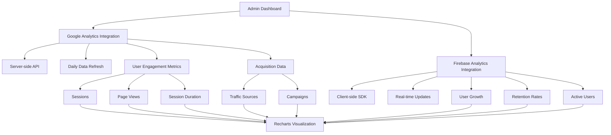
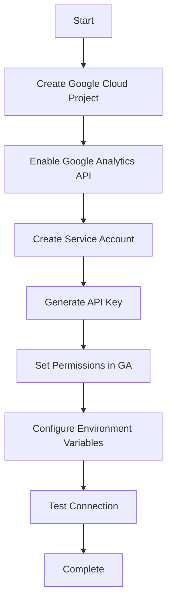
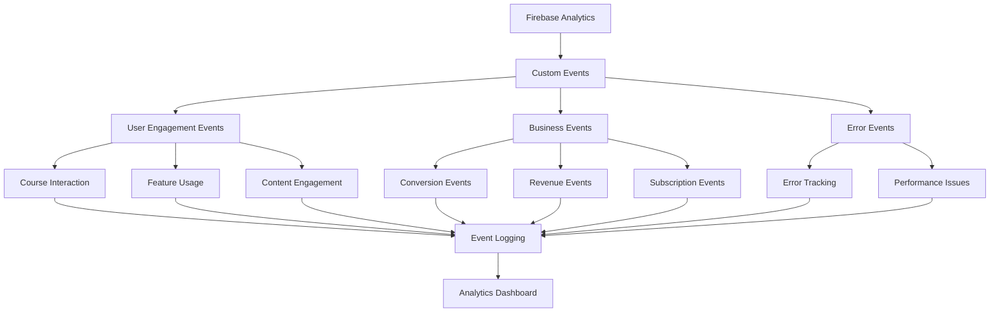

# Google Analytics and Firebase Analytics Integration Plan

This document outlines the comprehensive plan for integrating both Google Analytics and Firebase Analytics into the admin dashboard. We'll use a hybrid approach with server-side fetching for Google Analytics data (refreshed daily) and client-side real-time updates for Firebase data, visualizing everything with the existing Recharts library.

## Table of Contents

1. [Overview](#overview)
2. [Implementation Plan](#implementation-plan)
3. [Google Analytics API Setup](#google-analytics-api-setup)
4. [Firebase Analytics Integration](#firebase-analytics-integration)
5. [Custom Events Tracking](#custom-events-tracking)
6. [Dashboard Integration](#dashboard-integration)
7. [Testing and Optimization](#testing-and-optimization)

## Overview



## Implementation Plan

### Phase 1: Setup and Configuration

#### 1.1 Google Analytics API Setup

1. **Create a Google Cloud Project**:

   - Go to the [Google Cloud Console](https://console.cloud.google.com/)
   - Create a new project or select an existing one
   - Enable the Google Analytics API

2. **Create Service Account Credentials**:

   - In the Google Cloud Console, navigate to "APIs & Services" > "Credentials"
   - Create a service account
   - Download the JSON key file
   - Store the key file securely (not in version control)

3. **Configure Google Analytics Access**:

   - In Google Analytics, add the service account email as a user with read permissions
   - Note your Google Analytics View ID for later use

4. **Set Up Environment Variables**:
   - Add the following environment variables to your project:
     ```
     GOOGLE_APPLICATION_CREDENTIALS=path/to/your/credentials.json
     GOOGLE_ANALYTICS_VIEW_ID=your-view-id
     ```

#### 1.2 Firebase Analytics Configuration

1. **Install Firebase Analytics SDK** (if not already installed):

   ```bash
   npm install firebase/analytics
   ```

2. **Update Firebase Client Configuration**:
   - Ensure Firebase Analytics is enabled in your Firebase project
   - Update the Firebase client initialization to include analytics

### Phase 2: Backend Implementation for Google Analytics

#### 2.1 Create API Routes for Google Analytics Data

1. **Create a Google Analytics API Client**:

   - Create a utility file for the Google Analytics API client
   - Implement authentication using the service account
   - Create functions to fetch the required metrics

2. **Implement Server-side API Routes**:

   - Create API endpoints for each set of metrics
   - Implement caching to store data for 24 hours
   - Set up error handling and logging

3. **Create Data Processing Functions**:
   - Implement functions to process and format the raw Google Analytics data
   - Prepare the data for visualization with Recharts

### Phase 3: Frontend Implementation for Firebase Analytics

#### 3.1 Set Up Firebase Analytics Client

1. **Initialize Firebase Analytics**:

   - Update the Firebase client initialization to include analytics
   - Create a custom hook for accessing Firebase Analytics data

2. **Implement Real-time Data Fetching**:
   - Create functions to fetch real-time user data
   - Set up listeners for real-time updates
   - Implement data transformation for visualization

### Phase 4: Dashboard Integration

#### 4.1 Update Admin Dashboard Layout

1. **Create a New Analytics Tab**:

   - Add a new tab for integrated analytics
   - Design the layout to accommodate both Google Analytics and Firebase data

2. **Implement Analytics Components**:
   - Create reusable components for each metric
   - Implement loading states and error handling

#### 4.2 Create Visualization Components

1. **Implement Google Analytics Charts**:

   - User engagement metrics (sessions, page views, session duration)
   - Acquisition data (traffic sources, campaigns)

2. **Implement Firebase Analytics Charts**:
   - User growth charts
   - Retention rate visualizations
   - Real-time active users display

### Phase 5: Testing and Optimization

1. **Test Data Fetching**:

   - Verify that Google Analytics data is being fetched correctly
   - Ensure Firebase real-time updates are working

2. **Test Visualizations**:

   - Verify that charts are rendering correctly
   - Test responsiveness and performance

3. **Optimize Performance**:
   - Implement memoization for expensive calculations

## Google Analytics API Setup

### 1. Create a Google Cloud Project



#### Step 1: Create a Google Cloud Project

1. Go to the [Google Cloud Console](https://console.cloud.google.com/)
2. Click on the project dropdown at the top of the page
3. Click on "New Project"
4. Enter a project name (e.g., "LaunchpadAI Analytics")
5. Select an organization (if applicable)
6. Click "Create"
7. Wait for the project to be created and then select it from the dropdown

#### Step 2: Enable the Google Analytics API

1. In your new project, navigate to "APIs & Services" > "Library" in the left sidebar
2. Search for "Google Analytics API"
3. Click on "Google Analytics Data API" (or "Google Analytics Reporting API" depending on your needs)
4. Click "Enable"
5. If prompted, also enable the "Google Analytics Admin API"

### 2. Create a Service Account

#### Step 1: Create the Service Account

1. In the Google Cloud Console, navigate to "IAM & Admin" > "Service Accounts" in the left sidebar
2. Click "Create Service Account" at the top of the page
3. Enter a service account name (e.g., "analytics-service-account")
4. Add a description (e.g., "Service account for accessing Google Analytics data")
5. Click "Create and Continue"

#### Step 2: Grant Permissions to the Service Account

1. In the "Grant this service account access to project" section, add the following roles:
   - "BigQuery Data Viewer" (for accessing Analytics data)
   - "BigQuery Job User" (for running queries)
2. Click "Continue"
3. (Optional) Add users who can access this service account
4. Click "Done"

#### Step 3: Create a Key for the Service Account

1. In the service accounts list, find your newly created service account
2. Click on the three dots in the "Actions" column
3. Select "Manage keys"
4. Click "Add Key" > "Create new key"
5. Select "JSON" as the key type
6. Click "Create"
7. The key file will be automatically downloaded to your computer
8. **Important**: Store this file securely and never commit it to version control

### 3. Configure Google Analytics Access

#### Step 1: Find Your Google Analytics Account ID and Property ID

1. Log in to your [Google Analytics account](https://analytics.google.com/)
2. Navigate to "Admin" (gear icon in the bottom left)
3. In the "Account" column, note your Account ID
4. In the "Property" column, note your Property ID

#### Step 2: Grant Access to the Service Account

1. In Google Analytics, navigate to "Admin" > "Account Access Management" (under the Account column)
2. Click the "+" button to add a user
3. Enter the email address of your service account (it looks like `service-account-name@project-id.iam.gserviceaccount.com`)
4. Select "Viewer" role (or higher if needed)

### 4. Configure Your Next.js Application

#### Step 1: Store Credentials Securely

1. Create a directory for your credentials (outside of your source code)
2. Move the downloaded JSON key file to this directory
3. Add the directory to your `.gitignore` file to prevent accidental commits

#### Step 2: Set Up Environment Variables

Add the following environment variables to your `.env.local` file:

```
# Google Analytics API
GOOGLE_APPLICATION_CREDENTIALS=/path/to/your/credentials.json
GOOGLE_ANALYTICS_PROPERTY_ID=your-property-id
GOOGLE_ANALYTICS_ACCOUNT_ID=your-account-id
GOOGLE_ANALYTICS_VIEW_ID=your-view-id  # For Universal Analytics (GA3)
GOOGLE_ANALYTICS_MEASUREMENT_ID=your-measurement-id  # For GA4
```

For production deployment, add these environment variables to your hosting platform (Vercel, Netlify, etc.).

#### Step 3: Create a Secure Credentials Helper

Create a utility to securely load and use the credentials:

```typescript
// web/src/lib/google-analytics/credentials.ts
import { readFileSync } from "fs";
import path from "path";

interface GoogleCredentials {
  client_email: string;
  private_key: string;
  project_id: string;
}

let cachedCredentials: GoogleCredentials | null = null;

export function getGoogleCredentials(): GoogleCredentials {
  if (cachedCredentials) {
    return cachedCredentials;
  }

  try {
    // Check if credentials are provided as environment variables
    if (process.env.GOOGLE_CLIENT_EMAIL && process.env.GOOGLE_PRIVATE_KEY) {
      cachedCredentials = {
        client_email: process.env.GOOGLE_CLIENT_EMAIL,
        private_key: process.env.GOOGLE_PRIVATE_KEY.replace(/\\n/g, "\n"),
        project_id: process.env.GOOGLE_PROJECT_ID || "",
      };
      return cachedCredentials;
    }

    // Otherwise, load from the credentials file
    const credentialsPath = process.env.GOOGLE_APPLICATION_CREDENTIALS;
    if (!credentialsPath) {
      throw new Error(
        "GOOGLE_APPLICATION_CREDENTIALS environment variable is not set"
      );
    }

    const credentials = JSON.parse(
      readFileSync(path.resolve(credentialsPath), "utf8")
    );

    cachedCredentials = {
      client_email: credentials.client_email,
      private_key: credentials.private_key,
      project_id: credentials.project_id,
    };

    return cachedCredentials;
  } catch (error) {
    console.error("Error loading Google credentials:", error);
    throw new Error("Failed to load Google credentials");
  }
}
```

### 5. Create a Google Analytics API Client

Now, let's create a more robust Google Analytics API client that uses our secure credentials:

```typescript
// web/src/lib/google-analytics/client.ts
import { google } from "googleapis";
import { JWT } from "google-auth-library";
import { getGoogleCredentials } from "./credentials";

// Initialize the JWT client with service account credentials
export const initializeGoogleAnalyticsClient = () => {
  try {
    const credentials = getGoogleCredentials();

    const auth = new JWT({
      email: credentials.client_email,
      key: credentials.private_key,
      scopes: ["https://www.googleapis.com/auth/analytics.readonly"],
    });

    // For GA4 (Google Analytics 4)
    const analyticsData = google.analyticsdata({
      version: "v1beta",
      auth,
    });

    // For Universal Analytics (GA3)
    const analyticsReporting = google.analyticsreporting({
      version: "v4",
      auth,
    });

    return {
      analyticsData, // For GA4
      analyticsReporting, // For Universal Analytics
    };
  } catch (error) {
    console.error("Error initializing Google Analytics client:", error);
    throw error;
  }
};

// Helper function to determine if we're using GA4 or Universal Analytics
export const isGA4 = () => {
  return !!process.env.GOOGLE_ANALYTICS_MEASUREMENT_ID;
};

// Get the appropriate property ID
export const getPropertyId = () => {
  if (isGA4()) {
    return `properties/${process.env.GOOGLE_ANALYTICS_PROPERTY_ID}`;
  }
  return process.env.GOOGLE_ANALYTICS_VIEW_ID;
};
```

## Firebase Analytics Integration

### 1. Update Firebase Client Configuration

First, let's update the Firebase client initialization to include analytics:

```typescript
// web/src/lib/firebase/client.ts (update)
import { initializeApp, getApps } from "firebase/app";
import { getAuth, indexedDBLocalPersistence, signOut } from "firebase/auth";
import { getFirestore } from "firebase/firestore";
import { getAnalytics, isSupported } from "firebase/analytics";
import { useRouter } from "next/navigation";
import { useSetAtom } from "jotai";
import { clearUserProfileAtom } from "@/lib/store/user-store";

// Initialize Firebase client for browser environments
function getFirebaseClientApp() {
  const apps = getApps();
  if (apps.length > 0) {
    return apps[0];
  }

  const firebaseConfig = {
    apiKey: process.env.NEXT_PUBLIC_FIREBASE_API_KEY,
    authDomain: process.env.NEXT_PUBLIC_FIREBASE_AUTH_DOMAIN,
    projectId: process.env.NEXT_PUBLIC_FIREBASE_PROJECT_ID,
    storageBucket: process.env.NEXT_PUBLIC_FIREBASE_STORAGE_BUCKET,
    messagingSenderId: process.env.NEXT_PUBLIC_FIREBASE_MESSAGING_SENDER_ID,
    appId: process.env.NEXT_PUBLIC_FIREBASE_APP_ID,
    measurementId: process.env.NEXT_PUBLIC_FIREBASE_MEASUREMENT_ID,
  };

  return initializeApp(firebaseConfig);
}

export const clientApp = getFirebaseClientApp();

// Initialize Auth with proper persistence for better integration with Next.js
export const clientAuth = getAuth(clientApp);
clientAuth.setPersistence(
  typeof window !== "undefined"
    ? indexedDBLocalPersistence
    : indexedDBLocalPersistence
);

export const clientDb = getFirestore(
  clientApp,
  process.env.FIRESTORE_DATABASE_NAME as string
);

// Initialize Firebase Analytics (only in browser environment)
export const initializeAnalytics = async () => {
  if (typeof window !== "undefined") {
    try {
      const analyticsSupported = await isSupported();
      if (analyticsSupported) {
        return getAnalytics(clientApp);
      }
    } catch (error) {
      console.error("Firebase Analytics initialization error:", error);
    }
  }
  return null;
};

// Rest of the file remains the same...
```

### 2. Create a Custom Hook for Firebase Analytics

```typescript
// web/src/lib/firebase/hooks/useFirebaseAnalytics.ts
"use client";

import { useState, useEffect } from "react";
import { getAnalytics, isSupported, logEvent } from "firebase/analytics";
import { clientApp } from "../client";

export function useFirebaseAnalytics() {
  const [analytics, setAnalytics] = useState(null);
  const [isLoading, setIsLoading] = useState(true);
  const [error, setError] = useState(null);

  useEffect(() => {
    async function initAnalytics() {
      try {
        const analyticsSupported = await isSupported();
        if (analyticsSupported) {
          const analyticsInstance = getAnalytics(clientApp);
          setAnalytics(analyticsInstance);
        } else {
          setError("Firebase Analytics is not supported in this environment");
        }
      } catch (err) {
        setError(err.message);
      } finally {
        setIsLoading(false);
      }
    }

    initAnalytics();
  }, []);

  const trackEvent = (eventName, eventParams = {}) => {
    if (analytics) {
      logEvent(analytics, eventName, eventParams);
    }
  };

  return { analytics, isLoading, error, trackEvent };
}
```

### 3. Create Functions to Fetch Firebase Analytics Data

```typescript
// web/src/lib/firebase/analytics.ts
"use client";

import { useState, useEffect } from "react";
import { clientDb } from "./client";
import {
  collection,
  query,
  where,
  orderBy,
  limit,
  getDocs,
  onSnapshot,
} from "firebase/firestore";

// Fetch user growth data
export function useUserGrowthData(timeframe = "30d") {
  const [data, setData] = useState([]);
  const [isLoading, setIsLoading] = useState(true);
  const [error, setError] = useState(null);

  useEffect(() => {
    setIsLoading(true);

    // Calculate the start date based on the timeframe
    const now = new Date();
    const startDate = new Date();

    switch (timeframe) {
      case "7d":
        startDate.setDate(now.getDate() - 7);
        break;
      case "30d":
        startDate.setDate(now.getDate() - 30);
        break;
      case "90d":
        startDate.setDate(now.getDate() - 90);
        break;
      case "1y":
        startDate.setFullYear(now.getFullYear() - 1);
        break;
      default:
        startDate.setDate(now.getDate() - 30);
    }

    // Query Firestore for user creation dates
    const usersRef = collection(clientDb, "users");
    const q = query(
      usersRef,
      where("createdAt", ">=", startDate.getTime()),
      orderBy("createdAt", "asc")
    );

    const unsubscribe = onSnapshot(
      q,
      (snapshot) => {
        // Process the data to create a time series
        const usersByDate = {};

        snapshot.forEach((doc) => {
          const userData = doc.data();
          const creationDate = new Date(userData.createdAt);
          const dateKey = creationDate.toISOString().split("T")[0];

          if (!usersByDate[dateKey]) {
            usersByDate[dateKey] = 0;
          }

          usersByDate[dateKey]++;
        });

        // Convert to array format for charts
        const formattedData = Object.entries(usersByDate).map(
          ([date, count]) => ({
            date,
            newUsers: count,
          })
        );

        setData(formattedData);
        setIsLoading(false);
      },
      (err) => {
        console.error("Error fetching user growth data:", err);
        setError(err.message);
        setIsLoading(false);
      }
    );

    return () => unsubscribe();
  }, [timeframe]);

  return { data, isLoading, error };
}

// Fetch active users data
export function useActiveUsersData() {
  const [data, setData] = useState({ activeUsers: 0 });
  const [isLoading, setIsLoading] = useState(true);
  const [error, setError] = useState(null);

  useEffect(() => {
    setIsLoading(true);

    // Calculate the timestamp for 15 minutes ago
    const fifteenMinutesAgo = new Date();
    fifteenMinutesAgo.setMinutes(fifteenMinutesAgo.getMinutes() - 15);

    // Query Firestore for users with recent activity
    const usersRef = collection(clientDb, "users");
    const q = query(
      usersRef,
      where("lastActive", ">=", fifteenMinutesAgo.getTime())
    );

    const unsubscribe = onSnapshot(
      q,
      (snapshot) => {
        setData({ activeUsers: snapshot.size });
        setIsLoading(false);
      },
      (err) => {
        console.error("Error fetching active users data:", err);
        setError(err.message);
        setIsLoading(false);
      }
    );

    return () => unsubscribe();
  }, []);

  return { data, isLoading, error };
}

// Fetch user retention data
export function useRetentionData(timeframe = "30d") {
  const [data, setData] = useState([]);
  const [isLoading, setIsLoading] = useState(true);
  const [error, setError] = useState(null);

  useEffect(() => {
    // Implementation for retention data would go here
    // This is more complex and would require custom tracking in your app

    // For now, we'll use placeholder data
    setTimeout(() => {
      const placeholderData = [
        { cohort: "Week 1", retention: 100 },
        { cohort: "Week 2", retention: 85 },
        { cohort: "Week 3", retention: 72 },
        { cohort: "Week 4", retention: 68 },
        { cohort: "Week 5", retention: 65 },
        { cohort: "Week 6", retention: 62 },
        { cohort: "Week 7", retention: 60 },
        { cohort: "Week 8", retention: 58 },
      ];

      setData(placeholderData);
      setIsLoading(false);
    }, 1000);

    return () => {};
  }, [timeframe]);

  return { data, isLoading, error };
}
```

## Custom Events Tracking

### 1. Custom Events Overview



### 2. Setting Up Custom Event Tracking

Let's add a comprehensive custom events tracking system to your Firebase Analytics implementation:

```typescript
// web/src/lib/firebase/analytics/events.ts
import {
  getAnalytics,
  logEvent,
  setUserId,
  setUserProperties,
} from "firebase/analytics";
import { clientApp } from "../client";

// Initialize analytics
const getAnalyticsInstance = () => {
  if (typeof window !== "undefined") {
    try {
      return getAnalytics(clientApp);
    } catch (error) {
      console.error("Error initializing Firebase Analytics:", error);
      return null;
    }
  }
  return null;
};

// User Identification
export const identifyUser = (userId: string, userProperties = {}) => {
  const analytics = getAnalyticsInstance();
  if (!analytics) return;

  setUserId(analytics, userId);
  setUserProperties(analytics, userProperties);
};

// Event Categories
export const EventCategory = {
  COURSE: "course",
  CONTENT: "content",
  USER: "user",
  SUBSCRIPTION: "subscription",
  NAVIGATION: "navigation",
  SYSTEM: "system",
  ERROR: "error",
};

// Course Events
export const trackCourseView = (courseId: string, courseName: string) => {
  const analytics = getAnalyticsInstance();
  if (!analytics) return;

  logEvent(analytics, "course_view", {
    course_id: courseId,
    course_name: courseName,
  });
};

export const trackCourseStart = (courseId: string, courseName: string) => {
  const analytics = getAnalyticsInstance();
  if (!analytics) return;

  logEvent(analytics, "course_start", {
    course_id: courseId,
    course_name: courseName,
  });
};

export const trackCourseComplete = (
  courseId: string,
  courseName: string,
  timeToComplete: number
) => {
  const analytics = getAnalyticsInstance();
  if (!analytics) return;

  logEvent(analytics, "course_complete", {
    course_id: courseId,
    course_name: courseName,
    time_to_complete: timeToComplete, // in seconds
  });
};

export const trackLessonComplete = (
  courseId: string,
  courseName: string,
  lessonId: string,
  lessonName: string
) => {
  const analytics = getAnalyticsInstance();
  if (!analytics) return;

  logEvent(analytics, "lesson_complete", {
    course_id: courseId,
    course_name: courseName,
    lesson_id: lessonId,
    lesson_name: lessonName,
  });
};

// Content Engagement Events
export const trackContentView = (
  contentId: string,
  contentType: string,
  contentName: string
) => {
  const analytics = getAnalyticsInstance();
  if (!analytics) return;

  logEvent(analytics, "content_view", {
    content_id: contentId,
    content_type: contentType,
    content_name: contentName,
  });
};

export const trackContentEngagement = (
  contentId: string,
  contentType: string,
  engagementTime: number,
  engagementType: string
) => {
  const analytics = getAnalyticsInstance();
  if (!analytics) return;

  logEvent(analytics, "content_engagement", {
    content_id: contentId,
    content_type: contentType,
    engagement_time: engagementTime, // in seconds
    engagement_type: engagementType, // e.g., 'read', 'watch', 'interact'
  });
};

// User Events
export const trackProfileUpdate = (updatedFields: string[]) => {
  const analytics = getAnalyticsInstance();
  if (!analytics) return;

  logEvent(analytics, "profile_update", {
    updated_fields: updatedFields.join(","),
  });
};

export const trackFeatureUse = (featureId: string, featureName: string) => {
  const analytics = getAnalyticsInstance();
  if (!analytics) return;

  logEvent(analytics, "feature_use", {
    feature_id: featureId,
    feature_name: featureName,
  });
};

// Subscription Events
export const trackSubscriptionStart = (
  planId: string,
  planName: string,
  price: number,
  currency: string,
  isTrialPeriod: boolean
) => {
  const analytics = getAnalyticsInstance();
  if (!analytics) return;

  logEvent(analytics, "subscription_start", {
    plan_id: planId,
    plan_name: planName,
    price: price,
    currency: currency,
    is_trial: isTrialPeriod,
  });
};

export const trackSubscriptionRenew = (planId: string, planName: string) => {
  const analytics = getAnalyticsInstance();
  if (!analytics) return;

  logEvent(analytics, "subscription_renew", {
    plan_id: planId,
    plan_name: planName,
  });
};

export const trackSubscriptionCancel = (
  planId: string,
  planName: string,
  reason: string,
  daysActive: number
) => {
  const analytics = getAnalyticsInstance();
  if (!analytics) return;

  logEvent(analytics, "subscription_cancel", {
    plan_id: planId,
    plan_name: planName,
    reason: reason,
    days_active: daysActive,
  });
};

// Navigation Events
export const trackPageView = (pageName: string, pageType: string) => {
  const analytics = getAnalyticsInstance();
  if (!analytics) return;

  logEvent(analytics, "page_view", {
    page_name: pageName,
    page_type: pageType,
  });
};

export const trackSearch = (searchTerm: string, resultsCount: number) => {
  const analytics = getAnalyticsInstance();
  if (!analytics) return;

  logEvent(analytics, "search", {
    search_term: searchTerm,
    results_count: resultsCount,
  });
};

// Error Events
export const trackError = (
  errorCode: string,
  errorMessage: string,
  errorContext: string
) => {
  const analytics = getAnalyticsInstance();
  if (!analytics) return;

  logEvent(analytics, "app_error", {
    error_code: errorCode,
    error_message: errorMessage,
    error_context: errorContext,
  });
};

// Custom Event
export const trackCustomEvent = (
  eventName: string,
  eventParams: Record<string, any>
) => {
  const analytics = getAnalyticsInstance();
  if (!analytics) return;

  logEvent(analytics, eventName, eventParams);
};
```

### 3. Best Practices for Custom Event Tracking

#### Event Naming Conventions

1. **Use a consistent naming pattern**:

   - Use snake_case for event names (e.g., `course_complete`, `subscription_start`)
   - Group related events with common prefixes (e.g., `course_view`, `course_start`, `course_complete`)

2. **Be descriptive but concise**:

   - Event names should clearly indicate what happened
   - Avoid overly long names

3. **Use a hierarchical structure**:
   - Category > Action > Label pattern
   - Example: `course_lesson_complete` (category: course, action: lesson, label: complete)

#### Parameter Best Practices

1. **Consistent parameter naming**:

   - Use snake_case for parameter names
   - Be consistent with parameter names across events

2. **Include contextual information**:

   - Always include IDs and names for referenced objects
   - Include timestamps when relevant
   - Include user context when appropriate

3. **Limit the number of parameters**:
   - Focus on the most important data points
   - Avoid sending PII (Personally Identifiable Information)

#### Implementation Guidelines

1. **Create a centralized events module**:

   - Define all events in one place
   - Use helper functions to standardize event logging

2. **Add event tracking strategically**:

   - Focus on key user journeys
   - Track important business metrics
   - Monitor error conditions

3. **Test event tracking**:
   - Verify events are being sent correctly
   - Check that parameters are formatted properly
   - Ensure events appear in Firebase Analytics console

// Firebase client configuration
const firebaseConfig = {
apiKey: process.env.NEXT_PUBLIC_FIREBASE_API_KEY,
authDomain: process.env.NEXT_PUBLIC_FIREBASE_AUTH_DOMAIN,
projectId: process.env.NEXT_PUBLIC_FIREBASE_PROJECT_ID,
storageBucket: process.env.NEXT_PUBLIC_FIREBASE_STORAGE_BUCKET,
messagingSenderId: process.env.NEXT_PUBLIC_FIREBASE_MESSAGING_SENDER_ID,
appId: process.env.NEXT_PUBLIC_FIREBASE_APP_ID,
measurementId: process.env.NEXT_PUBLIC_FIREBASE_MEASUREMENT_ID, // Add this line
};

// Initialize Firebase client for browser environments
function getFirebaseClientApp() {
const apps = getApps();
if (apps.length > 0) {
return apps[0];
}

return initializeApp(firebaseConfig);
}

export const clientApp = getFirebaseClientApp();

// Initialize Auth with proper persistence for better integration with Next.js
export const clientAuth = getAuth(clientApp);
clientAuth.setPersistence(
typeof window !== "undefined"
? indexedDBLocalPersistence
: indexedDBLocalPersistence
);

export const clientDb = getFirestore(
clientApp,
process.env.FIRESTORE_DATABASE_NAME as string
);

// Initialize Firebase Analytics (only in browser environment)
export const initializeAnalytics = async () => {
if (typeof window !== "undefined") {
try {
const analyticsSupported = await isSupported();
if (analyticsSupported) {
return getAnalytics(clientApp);
}
} catch (error) {
console.error("Firebase Analytics initialization error:", error);
}
}
return null;
};

// Rest of the file remains the same...

```

5. Click "Add"

#### Step 3: Enable Google Analytics 4 Data API Access

1. In Google Analytics, navigate to "Admin" > "Data Streams" (under the Property column)
2. Select your web data stream
3. Under "Additional settings", find "Measurement Protocol API secrets"
4. Click "Create" to create a new API secret
5. Note the API secret value
   - Optimize rendering performance

```

```

```
