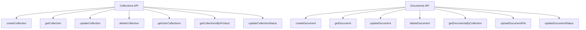

# Document Collections Feature Implementation Plan

Based on my analysis of the existing codebase, I've created a detailed implementation plan for the new document collections feature. This feature will allow users to create and manage document collections tied to specific products.

## Overview of Current Architecture

From examining the codebase, I've identified these key patterns:

1. **Data Storage**: Firebase Firestore for data, Firebase Storage for files
2. **State Management**: Jotai atoms for local state
3. **Data Fetching**: React Server Actions + Tanstack Query
4. **UI Components**: Shadcn UI components with Tanstack Table for data tables
5. **Routing**: Next.js App Router
6. **File Uploads**: Custom components using Firebase Storage

## Data Schema Design

First, let's define the data schemas for our new feature:

### Collection Schema

```typescript
// Collection status type
export type CollectionStatus =
  | "uploading"
  | "uploaded"
  | "indexing"
  | "indexed"
  | "reindexing";

// Collection schema
export interface Collection {
  id: string;
  productId: string;
  userId: string;
  title: string;
  description: string;
  phaseTags: string[]; // Array of phase tags
  tags: string[]; // Array of general tags
  status: CollectionStatus; // Status of the collection
  createdAt: number;
  updatedAt: number;
}

// Collection input schema (for validation)
export const collectionInputSchema = z.object({
  productId: z.string().min(1, "Product ID is required"),
  title: z.string().min(1, "Title is required").max(100, "Title is too long"),
  description: z.string(),
  phaseTags: z.array(z.string()),
  tags: z.array(z.string()),
  status: z
    .enum(["uploading", "uploaded", "indexing", "indexed", "reindexing"])
    .default("uploaded"),
});

export type CollectionInput = z.infer<typeof collectionInputSchema>;
```

### Document Schema

```typescript
// Document status type
export type DocumentStatus =
  | "uploading"
  | "uploaded"
  | "indexing"
  | "indexed"
  | "reindexing";

// Document schema
export interface Document {
  id: string;
  collectionId: string;
  productId: string;
  userId: string;
  title: string;
  description: string;
  url: string; // Signed URL to the document in Firebase Storage
  filePath: string; // Path to the document in Firebase Storage
  tags: string[]; // Array of tags
  status: DocumentStatus; // Status of the document
  createdAt: number;
  updatedAt: number;
}

// Document input schema (for validation)
export const documentInputSchema = z.object({
  collectionId: z.string().min(1, "Collection ID is required"),
  productId: z.string().min(1, "Product ID is required"),
  title: z.string().min(1, "Title is required").max(100, "Title is too long"),
  description: z.string(),
  url: z.string().optional(),
  filePath: z.string().optional(),
  tags: z.array(z.string()),
  status: z
    .enum(["uploading", "uploaded", "indexing", "indexed", "reindexing"])
    .default("uploading"),
});

export type DocumentInput = z.infer<typeof documentInputSchema>;
```

## Implementation Roadmap

### 1. Firebase Setup

#### 1.1 Firestore Collections

Create the following Firestore collections:

- `collections/{user_id}/collection` - Stores collection data
- `documents/{user_id}/document` - Stores document data

#### 1.2 Firebase Storage Structure

Set up Firebase Storage paths:

- `storage/{user_id}/collections/{collection_id}/documents/{document_id}` - For document files

#### 1.3 Firebase Functions

Create the following Firebase functions in `web/src/lib/firebase/collections.ts` and `web/src/lib/firebase/documents.ts`:



### 2. State Management

#### 2.1 Jotai Atoms

Create the following Jotai atoms in `web/src/lib/store/collection-store.ts`:

```typescript
// Base data atoms
export const allCollectionsAtom = atom<Collection[]>([]);
export const selectedProductIdAtom = atom<string | null>(null);
export const selectedCollectionAtom = atom<Collection | null>(null);
export const selectedDocumentAtom = atom<Document | null>(null);

// UI state atoms
export const collectionViewModeAtom = atom<"grid" | "table">("grid");
export const collectionModalOpenAtom = atom<boolean>(false);
export const documentModalOpenAtom = atom<boolean>(false);

// Table state atoms
export const collectionRowSelectionAtom = atom<Record<string, boolean>>({});
export const documentRowSelectionAtom = atom<Record<string, boolean>>({});
export const columnFiltersAtom = atom<ColumnFiltersState>([]);
export const sortingAtom = atom<SortingState>([
  { id: "updatedAt", desc: true },
]);
export const columnVisibilityAtom = atom<Record<string, boolean>>({});

// Optimistic update atoms
export const updateCollectionAtom = atom(
  null,
  (get, set, updatedCollection: Collection) => {
    set(allCollectionsAtom, (prev) =>
      prev.map((collection) =>
        collection.id === updatedCollection.id ? updatedCollection : collection
      )
    );
  }
);

export const updateCollectionStatusAtom = atom(
  null,
  (get, set, payload: { id: string; status: CollectionStatus }) => {
    set(allCollectionsAtom, (prev) =>
      prev.map((collection) =>
        collection.id === payload.id
          ? {
              ...collection,
              status: payload.status,
              updatedAt: Date.now() / 1000,
            }
          : collection
      )
    );
  }
);

export const deleteCollectionAtom = atom(
  null,
  (get, set, collectionId: string) => {
    set(allCollectionsAtom, (prev) =>
      prev.filter((collection) => collection.id !== collectionId)
    );
  }
);

export const addCollectionAtom = atom(
  null,
  (get, set, newCollection: Collection) => {
    set(allCollectionsAtom, (prev) => [...prev, newCollection]);
  }
);
```

#### 2.2 Custom Hooks

Create the following custom hooks in `web/src/hooks/useCollections.ts` and `web/src/hooks/useDocuments.ts`:

```typescript
// useCollections hook
export function useCollections({
  productId = null,
  loadCollections = true,
}: {
  productId?: string | null;
  loadCollections?: boolean;
} = {}) {
  // State atoms
  const [collections, setCollections] = useAtom(allCollectionsAtom);
  const [isLoading, setIsLoading] = useState(false);
  const [error, setError] = useState<string | null>(null);
  const [selectedCollection, setSelectedCollection] = useAtom(
    selectedCollectionAtom
  );

  // Fetch collections
  const fetchCollections = useCallback(async () => {
    // Implementation
  }, [productId]);

  // Update collection status
  const updateCollectionStatus = useCallback(
    async (collectionId: string, status: CollectionStatus) => {
      // Implementation
    },
    []
  );

  // Other functions

  return {
    collections,
    isLoading,
    error,
    fetchCollections,
    updateCollectionStatus,
    selectedCollection,
    setSelectedCollection,
    // Other return values
  };
}

// useDocuments hook
export function useDocuments({
  collectionId = null,
  loadDocuments = true,
}: {
  collectionId?: string | null;
  loadDocuments?: boolean;
} = {}) {
  // Implementation including document status management
}
```

### 3. Server Actions

Create the following server actions in `web/src/app/(protected)/mycollections/actions.ts`:

```typescript
// Collection actions
export async function createCollectionAction(data: CollectionInput) {
  // Implementation
}

export async function updateCollectionAction(
  id: string,
  data: CollectionInput
) {
  // Implementation
}

export async function updateCollectionStatusAction(
  id: string,
  status: CollectionStatus
) {
  // Implementation
}

export async function deleteCollectionAction(id: string) {
  // Implementation
}

export async function deleteMultipleCollectionsAction(ids: string[]) {
  // Implementation
}

// Document actions
export async function createDocumentAction(data: DocumentInput, file: File) {
  // Implementation with status handling
  // Initially set status to "uploading"
  // After upload completes, update to "uploaded"
  // Then trigger indexing process if needed
}

export async function updateDocumentAction(
  id: string,
  data: DocumentInput,
  file?: File
) {
  // Implementation with status handling
}

export async function updateDocumentStatusAction(
  id: string,
  status: DocumentStatus
) {
  // Implementation
}

export async function deleteDocumentAction(id: string) {
  // Implementation
}

export async function deleteMultipleDocumentsAction(ids: string[]) {
  // Implementation
}
```

### 4. UI Components

#### 4.1 Page Structure

```
web/src/app/(protected)/mycollections/
├── page.tsx                      # Main collections page
├── actions.ts                    # Server actions
├── components/                   # Components for collections page
│   ├── collection-form.tsx       # Form for creating/editing collections
│   ├── collection-card.tsx       # Card view for collections
│   ├── collection-table.tsx      # Table view for collections
│   ├── collections-columns.tsx   # Column definitions for collections table
│   ├── status-badge.tsx          # Component to display status with appropriate styling
│   └── ...                       # Other table-related components
└── collection/                   # Collection detail page
    ├── page.tsx                  # Collection detail page
    ├── components/               # Components for collection detail page
    │   ├── document-form.tsx     # Form for creating/editing documents
    │   ├── document-table.tsx    # Table for documents
    │   ├── documents-columns.tsx # Column definitions for documents table
    │   └── ...                   # Other table-related components
    └── ...
```

#### 4.2 Main Collections Page

The main collections page will have:

1. Product selector at the top
2. View mode toggle (grid/table)
3. Grid or table view of collections
4. Create collection button
5. Search and filter functionality
6. Status indicators for each collection

#### 4.3 Collection Detail Page

The collection detail page will have:

1. Collection details at the top with status indicator
2. Tabs for "General" and "Documents"
3. Add Document button
4. Table of documents with status indicators
5. Document form modal

### 5. Status Badge Component

Create a reusable status badge component:

```typescript
// Status badge component
export function StatusBadge({ status }: { status: CollectionStatus | DocumentStatus }) {
  // Define color and icon based on status
  const getStatusConfig = (status: string) => {
    switch (status) {
      case "uploading":
        return { color: "blue", icon: <UploadIcon className="h-3 w-3 mr-1" />, label: "Uploading" };
      case "uploaded":
        return { color: "green", icon: <CheckIcon className="h-3 w-3 mr-1" />, label: "Uploaded" };
      case "indexing":
        return { color: "yellow", icon: <RefreshCwIcon className="h-3 w-3 mr-1 animate-spin" />, label: "Indexing" };
      case "indexed":
        return { color: "green", icon: <SearchIcon className="h-3 w-3 mr-1" />, label: "Indexed" };
      case "reindexing":
        return { color: "purple", icon: <RefreshCwIcon className="h-3 w-3 mr-1 animate-spin" />, label: "Reindexing" };
      default:
        return { color: "gray", icon: <InfoIcon className="h-3 w-3 mr-1" />, label: status };
    }
  };

  const { color, icon, label } = getStatusConfig(status);

  return (
    <Badge variant={color as any} className="flex items-center">
      {icon}
      {label}
    </Badge>
  );
}
```

### 6. Implementation Steps

Let's break down the implementation into manageable steps:

#### Step 1: Schema and Firebase Functions

1. Add collection and document schemas to `web/src/lib/firebase/schema.ts` with status field
2. Create `web/src/lib/firebase/collections.ts` with CRUD functions and status update function
3. Create `web/src/lib/firebase/documents.ts` with CRUD functions and status update function
4. Add document upload functions to handle file storage and status transitions

#### Step 2: State Management

1. Create `web/src/lib/store/collection-store.ts` with Jotai atoms including status management
2. Create `web/src/hooks/useCollections.ts` hook with status update functions
3. Create `web/src/hooks/useDocuments.ts` hook with status update functions

#### Step 3: Server Actions

1. Create `web/src/app/(protected)/mycollections/actions.ts` with server actions for collections and documents, including status management

#### Step 4: UI Components - Collections

1. Create the main collections page structure
2. Implement the product selector component
3. Create collection form component with status field
4. Implement collection card component for grid view with status badge
5. Implement collection table component for table view with status column
6. Add search and filter functionality including status filtering

#### Step 5: UI Components - Documents

1. Create the collection detail page structure
2. Implement tabs for "General" and "Documents"
3. Create document form component with file upload and status handling
4. Implement document table component with status column
5. Add document actions (view, edit, delete)

#### Step 6: Status Management

1. Implement status transitions for documents (uploading → uploaded → indexing → indexed)
2. Add ability to manually trigger reindexing
3. Add visual indicators for each status state
4. Implement status filtering in tables

#### Step 7: Testing and Refinement

1. Test all CRUD operations for collections
2. Test all CRUD operations for documents
3. Test file uploads and downloads
4. Test status transitions
5. Refine UI and fix any issues

## Technical Considerations

### File Upload Process

For document uploads, we'll follow this process:

1. User selects a file in the document form
2. Document is created with status "uploading"
3. File is uploaded to Firebase Storage using a server action
4. The server action returns a signed URL and file path
5. The document is updated with the URL, file path, and status "uploaded"
6. Optionally trigger indexing process, changing status to "indexing"
7. When indexing completes, update status to "indexed"

### Status Management

The status field will be used to track the lifecycle of collections and documents:

1. **uploading**: Initial state when a document is being uploaded
2. **uploaded**: Document has been successfully uploaded but not yet indexed
3. **indexing**: Document is currently being processed for search/analysis
4. **indexed**: Document has been fully processed and is ready for use
5. **reindexing**: Document is being reprocessed (e.g., after updates)

Collections will typically mirror the aggregate status of their documents or have their own independent status.

### State Management Strategy

We'll use a combination of Jotai atoms and Tanstack Query:

1. Jotai atoms for UI state (selected collection, view mode, etc.)
2. Tanstack Query for data fetching and caching
3. Optimistic updates for a responsive UI
4. Status-specific UI components and logic

### Performance Considerations

1. Use pagination for document tables with many entries
2. Implement efficient filtering and sorting on the client side
3. Use optimistic updates to avoid UI flicker
4. Limit unnecessary re-renders by using memoization
5. Show appropriate loading states during status transitions

## UI Mockups

### Collections Page with Status

```
+---------------------------------------------------------------+
| My Collections                                  [Create New +] |
+---------------------------------------------------------------+
| [Product Selector v]                    [Grid] | [Table]       |
+---------------------------------------------------------------+
| [Search...]                [Status ▼]                          |
+---------------------------------------------------------------+
| Grid View:                                                     |
|  +---------------+    +---------------+    +---------------+   |
|  | Collection 1  |    | Collection 2  |    | Collection 3  |   |
|  | Description   |    | Description   |    | Description   |   |
|  | Tags: Tag1... |    | Tags: Tag1... |    | Tags: Tag1... |   |
|  | [INDEXED]     |    | [UPLOADING]   |    | [INDEXED]     |   |
|  | [...]         |    | [...]         |    | [...]         |   |
|  +---------------+    +---------------+    +---------------+   |
|                                                               |
| Table View:                                                   |
| +-------+-------------+----------+----------+--------+-------+ |
| | [ ]   | Title       | Phase    | Tags     | Status | [...] | |
| +-------+-------------+----------+----------+--------+-------+ |
| | [ ]   | Collection 1| Design   | Tag1,... |[INDEXED]| [...] | |
| | [ ]   | Collection 2| Build    | Tag2,... |[UPLOAD.]| [...] | |
| +-------+-------------+----------+----------+--------+-------+ |
+---------------------------------------------------------------+
```

### Collection Detail Page with Status

```
+---------------------------------------------------------------+
| < Back to Collections                                          |
+---------------------------------------------------------------+
| Collection Title [INDEXED]                     [+ Add Document]|
| Description                                                    |
+---------------------------------------------------------------+
| [General] | [Documents]                                        |
+---------------------------------------------------------------+
| Documents Tab:                                                 |
| +-------+-------------+----------+----------+--------+-------+ |
| | [ ]   | Title       | Tags     | Date     | Status | [...] | |
| +-------+-------------+----------+----------+--------+-------+ |
| | [ ]   | Document 1  | Tag1,... | Today    |[INDEX.]| [...] | |
| | [ ]   | Document 2  | Tag2,... | Today    |[UPLOAD]| [...] | |
| +-------+-------------+----------+----------+--------+-------+ |
+---------------------------------------------------------------+
```

### Document Form Modal with Status

```
+---------------------------------------------------------------+
| Add Document                                          [X]      |
+---------------------------------------------------------------+
| Document Title                                                 |
| [                                                          ]   |
|                                                               |
| Description                                                   |
| [                                                          ]   |
| [                                                          ]   |
|                                                               |
| Tags                                                          |
| [                                      ] [Add]                |
| [Tag1] [Tag2] [Tag3]                                         |
|                                                               |
| Upload Document                                               |
| [Drop file here or click to upload                        ]   |
|                                                               |
| Status: [Uploading ▼]                                         |
|                                                               |
| [Cancel]                                          [Save]      |
+---------------------------------------------------------------+
```

## Conclusion

This implementation plan provides a comprehensive roadmap for building the document collections feature with status tracking. By following the existing patterns in the codebase and leveraging the same technologies, we can ensure a consistent user experience and maintainable code.

The plan breaks down the work into manageable steps, starting with the data schema and Firebase functions, then moving on to state management, server actions, and finally the UI components. The addition of the status field provides important context about the state of collections and documents, allowing for better user feedback and more robust processing workflows.
