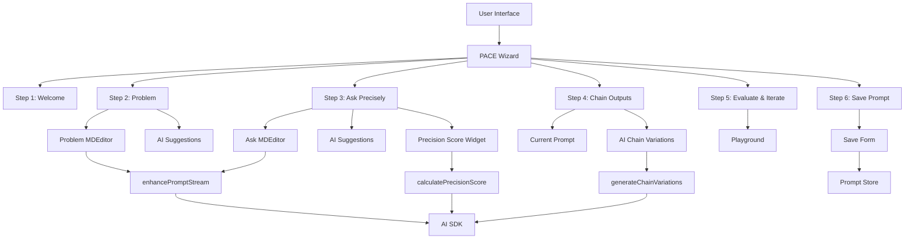

# PACE Framework Wizard Implementation Plan

## Overview

We'll create a structured wizard for the PACE (Problem, Ask, Chain, Evaluate) framework under `/myprompts/pace`. The wizard will follow a similar pattern to the existing `/mystacks/create` wizard, with six clearly defined steps. We'll reuse the existing prompt store with new atoms for PACE-specific state and extend the existing AI enhancement capabilities.

## Architecture Diagram



## State Management

We'll extend the existing prompt store with new atoms for PACE-specific state:

```typescript
// New atoms for PACE wizard
export const currentPaceStepAtom = atom<number>(1);
export const paceWizardStateAtom = atom<PaceWizardState>({
  problem: "",
  ask: "",
  chainVariations: ["", ""],
  precisionScore: 0,
  finalPrompt: "",
  title: "",
  phase: [],
  tags: [],
});
```

## File Structure

```
web/src/app/(protected)/myprompts/pace/
├── page.tsx                  # Main wizard page
├── actions.ts                # PACE-specific server actions
├── components/
│   ├── step-indicator.tsx    # Navigation component
│   ├── steps/
│   │   ├── welcome-step.tsx  # Step 1: Welcome
│   │   ├── problem-step.tsx  # Step 2: Problem
│   │   ├── ask-step.tsx      # Step 3: Ask Precisely
│   │   ├── chain-step.tsx    # Step 4: Chain Outputs
│   │   ├── evaluate-step.tsx # Step 5: Evaluate & Iterate
│   │   └── save-step.tsx     # Step 6: Save Prompt
│   ├── precision-score.tsx   # Precision score widget
│   └── suggestion-button.tsx # AI suggestion button component
```

## Detailed Implementation Plan

### 1. Setup Basic Structure

1. Create the main wizard page at `/myprompts/pace/page.tsx`
2. Implement the step indicator component
3. Create skeleton components for each step
4. Set up navigation between steps

### 2. State Management

1. Create new atoms in the prompt store for PACE-specific state
2. Implement state management for each step
3. Ensure state persistence between steps

### 3. Step 1: Welcome

1. Create a welcome message introducing the PACE framework
2. Explain the benefits of using PACE for prompt development
3. Set user expectations regarding the estimated duration
4. Add a prominent 'Next' button for navigation

### 4. Step 2: Problem

1. Implement a two-column interface:
   - Main column with MDEditor for problem description
   - Left column for AI-generated suggestions
2. Create the suggestion button component
3. Extend the `enhancePromptStream` action to generate problem-specific suggestions
4. Implement the onBlur event to trigger AI suggestions
5. Add navigation buttons

### 5. Step 3: Ask Precisely

1. Mirror the Problem step structure but focus on crafting a precise prompt
2. Implement the Precision Score widget using recharts:

   ```typescript
   import { Pie, PieChart } from "recharts";
   import { Card } from "@/components/ui/card";

   export function PrecisionScore({ score }: { score: number }) {
     const data = [
       { name: "Score", value: score },
       { name: "Remaining", value: 100 - score },
     ];

     return (
       <Card className="p-4">
         <h3 className="text-lg font-medium mb-2">Precision Score</h3>
         <div className="flex items-center justify-center">
           <PieChart width={150} height={150}>
             <Pie
               data={data}
               cx="50%"
               cy="50%"
               innerRadius={40}
               outerRadius={60}
               fill="#8884d8"
               dataKey="value"
             >
               <Cell key="cell-0" fill="#10b981" />
               <Cell key="cell-1" fill="#e5e7eb" />
             </Pie>
           </PieChart>
           <div className="text-3xl font-bold ml-4">{score}</div>
         </div>
       </Card>
     );
   }
   ```

3. Create a new AI action to calculate the precision score
4. Add navigation buttons

### 6. Step 4: Chain Outputs

1. Create a three-box interface:
   - Box 1: Display the user's current prompt
   - Boxes 2 and 3: Show AI-generated variations for chaining
2. Implement a new AI action to generate chain variations
3. Add enhance buttons for each box
4. Add navigation buttons

### 7. Step 5: Evaluate and Iterate

1. Create a test area similar to the existing playground
2. Reuse components from `/myprompts/prompt/playground.tsx`
3. Show the combined prompt in the MDEditor with tabbed options
4. Add navigation buttons

### 8. Step 6: Save Prompt

1. Create a form for saving the finalized prompt
2. Include fields for title, phase, and tags
3. Implement the save functionality using existing prompt actions
4. Add a redirect to `/myprompts` on successful save

### 9. UI Integration

1. Add a "+ Create PACE Prompt" button in the top right of `/myprompts`
2. Ensure all UI components adhere to the standards of `/mystacks`
3. Implement consistent step design, animations, and form validations

### 10. AI Actions

1. Extend the existing `enhancePromptStream` action:

   ```typescript
   export async function enhancePromptStream(
     promptText: string,
     instructions?: string,
     settings?: Partial<AIModelSettings>,
     selectedProduct?: Product | null,
     paceMode?: "problem" | "ask" | "chain" | null
   ) {
     // Existing code...

     // Add PACE-specific system prompts based on mode
     if (paceMode) {
       switch (paceMode) {
         case "problem":
           // Add problem-specific system prompt
           break;
         case "ask":
           // Add ask-specific system prompt
           break;
         case "chain":
           // Add chain-specific system prompt
           break;
       }
     }

     // Rest of the existing code...
   }
   ```

2. Create a new action for calculating precision score:

   ```typescript
   export async function calculatePrecisionScore(promptText: string) {
     // Implementation using AI to evaluate precision
     // Return a score between 0 and 100
   }
   ```

3. Create a new action for generating chain variations:
   ```typescript
   export async function generateChainVariations(promptText: string) {
     // Implementation using AI to generate variations
     // Return an array of variations
   }
   ```

## Technical Considerations

1. **Performance**: Ensure AI calls are optimized to minimize latency
2. **Error Handling**: Implement robust error handling for AI calls
3. **Accessibility**: Ensure all components are accessible
4. **Responsiveness**: Ensure the wizard works well on all device sizes
5. **Testing**: Create tests for critical components and actions

## Implementation Timeline

1. **Phase 1**: Basic structure, navigation, and state management (2 days)
2. **Phase 2**: Implement Steps 1-3 (3 days)
3. **Phase 3**: Implement Steps 4-6 (3 days)
4. **Phase 4**: UI Integration and polish (2 days)
5. **Phase 5**: Testing and bug fixes (2 days)
