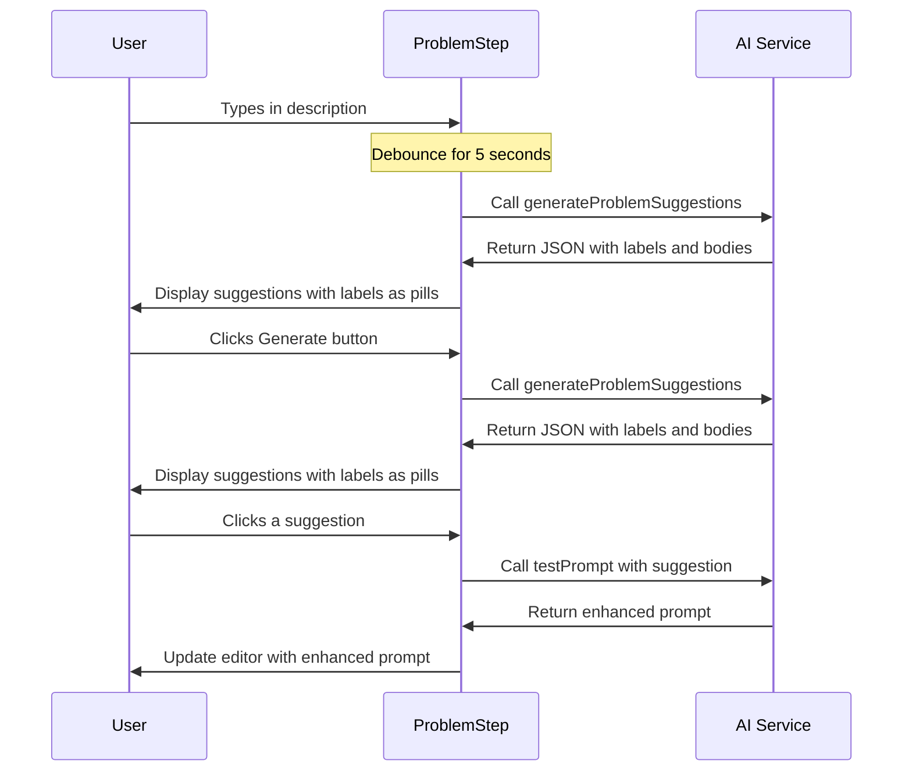

# Problem Step Refactoring Plan

This document outlines the plan for refactoring the AI calls and logic of the buttons on the Problem step of the PACE wizard.

## Current Implementation Analysis

The current implementation has the following components and flow:

1. **ProblemStep Component**:

   - Contains a text editor for the user to input their problem description
   - Has a "Generate" button that triggers AI suggestions
   - Suggestions are also triggered when the editor loses focus with content

2. **AI Call Flow**:

   - `handleGenerateSuggestions` function calls the `generateProblemSuggestions` server action
   - The server action uses OpenAI with a system prompt that requests 5 plain text suggestions
   - The response is streamed back to the client
   - The component formats these suggestions with hard-coded prefixes:
     - "Reframe as business challenge"
     - "Technical deep dive"
     - "User-centered perspective"
     - "Scope definition"
     - "Risk assessment lens"

3. **SuggestionButton Component**:
   - Displays a suggestion with the prefix as a pill/badge
   - Shows a truncated version of the suggestion text
   - When clicked, applies the suggestion to the problem description

## Refactoring Requirements

1. Add a debounced onChange handler to trigger AI call after 5 seconds of inactivity
2. Make an AI call that returns structured JSON with five actions as follow-up items
3. Each action should have a label (displayed as a pill) and a body
4. The labels and contents should come from the AI server action, not from hard-coded values

## Detailed Refactoring Plan

### 1. Update the System Prompt in actions.ts

Modify the `PROBLEM_ENHANCEMENT_SYSTEM_PROMPT` to instruct the AI to return structured JSON instead of plain text suggestions:

```typescript
const PROBLEM_ENHANCEMENT_SYSTEM_PROMPT = `You are an expert at helping users define problems clearly for AI prompts.
Your goal is to help the user refine their problem statement to be more specific, clear, and actionable.

When enhancing problem statements, follow these guidelines:
1. Identify the core problem or goal
2. Add relevant context that might be missing
3. Remove ambiguity and vagueness
4. Make the problem statement more specific and concrete
5. Ensure the problem is framed in a way that leads to actionable solutions

Provide 5 different suggestions for improving the problem statement, each taking a slightly different approach.
Each suggestion should have a label that describes the approach and a body that contains the actual suggestion.

Your response must be a valid JSON object with the following structure:
{
  "suggestions": [
    {
      "label": "Short descriptive label for the approach (e.g., 'Business Challenge', 'Technical Perspective')",
      "body": "Complete suggestion text that the user can apply directly"
    },
    // ... 4 more suggestions with the same structure
  ]
}

Make each suggestion distinct and valuable in its own way. The labels should be concise (2-4 words) and descriptive of the approach taken.`;
```

### 2. Update the generateProblemSuggestions Function in actions.ts

Modify the function to parse the AI response as JSON and ensure it has the correct structure:

```typescript
export async function generateProblemSuggestions(problemText: string) {
  // Create a streamable value for the output
  const stream = createStreamableValue("");

  // Start streaming in the background
  (async () => {
    try {
      const messages: Omit<Message, "id">[] = [
        { role: "system", content: PROBLEM_ENHANCEMENT_SYSTEM_PROMPT },
        { role: "user", content: problemText },
      ];

      const result = await streamText({
        model: openai(defaultSettings.modelId),
        messages,
        temperature: defaultSettings.temperature,
        maxTokens: defaultSettings.maxTokens,
        topP: defaultSettings.topP,
      });

      // Collect the full response instead of streaming
      let fullResponse = "";
      for await (const delta of result.textStream) {
        fullResponse += delta;
      }

      // Try to parse the response as JSON
      try {
        // Ensure the response is valid JSON
        const jsonResponse = JSON.parse(fullResponse);

        // Validate the structure
        if (
          !jsonResponse.suggestions ||
          !Array.isArray(jsonResponse.suggestions)
        ) {
          throw new Error(
            "Invalid response structure: missing suggestions array"
          );
        }

        // Stream the validated JSON response
        stream.update(JSON.stringify(jsonResponse));
        stream.done();
      } catch (jsonError) {
        console.error("Error parsing AI response as JSON:", jsonError);
        stream.error("Failed to parse AI response as JSON");
      }
    } catch (error) {
      console.error("Error generating problem suggestions:", error);
      stream.error(
        "Failed to generate suggestions: " +
          (error instanceof Error ? error.message : String(error))
      );
    }
  })();

  // Return the streamable value for UI consumption
  return { output: stream.value };
}
```

### 3. Create a New Interface for Suggestions in problem-step.tsx

Add a new interface to define the structure of the suggestions:

```typescript
interface ProblemSuggestion {
  label: string;
  body: string;
}
```

### 4. Update the handleGenerateSuggestions Function in problem-step.tsx

Modify the function to handle the JSON response:

```typescript
const handleGenerateSuggestions = async () => {
  if (!wizardState.problem.trim() || isLoading) return;

  setIsLoading(true);
  try {
    // Call the AI service to generate suggestions
    const currentPrompt = wizardState.problem.trim();
    const result = await generateProblemSuggestions(currentPrompt);

    // Process the streamable value
    let fullOutput = "";
    for await (const delta of readStreamableValue(result.output)) {
      fullOutput += delta;
    }

    if (fullOutput) {
      try {
        // Parse the JSON response
        const jsonResponse = JSON.parse(fullOutput);

        // Validate and set the suggestions
        if (
          jsonResponse.suggestions &&
          Array.isArray(jsonResponse.suggestions)
        ) {
          setSuggestions(jsonResponse.suggestions);
        } else {
          console.error("Invalid suggestions format:", jsonResponse);
          setSuggestions([]);
        }
      } catch (jsonError) {
        console.error("Error parsing suggestions JSON:", jsonError);
        setSuggestions([]);
      }
    }
  } catch (error) {
    console.error("Error generating suggestions:", error);
  } finally {
    setIsLoading(false);
  }
};
```

### 5. Add Debounced onChange Handler in problem-step.tsx

Add a debounced handler to trigger suggestions after 5 seconds of inactivity:

```typescript
// Add import for useEffect and useRef
import { useState, useEffect, useRef } from "react";

// Add debounce timer ref
const debounceTimerRef = useRef<NodeJS.Timeout | null>(null);

// Add debounced onChange handler
const handleEditorChange = (value: string) => {
  // Update the field immediately
  updateField({
    problem: value || "",
    unifiedPrompt: value || "",
  });

  // Clear any existing timer
  if (debounceTimerRef.current) {
    clearTimeout(debounceTimerRef.current);
  }

  // Set a new timer if there's content
  if (value.trim()) {
    debounceTimerRef.current = setTimeout(() => {
      handleGenerateSuggestions();
    }, 5000); // 5 seconds debounce
  }
};
```

### 6. Update the AnimatedMDEditor in problem-step.tsx

Modify the editor to use the new debounced handler:

```typescript
<AnimatedMDEditor
  value={
    wizardState.unifiedPrompt.trim()
      ? wizardState.unifiedPrompt
      : typeof wizardState.problem === "string"
        ? wizardState.problem
        : String(wizardState.problem)
  }
  onChange={handleEditorChange}
  onBlur={handleEditorBlur}
  height={300}
  preview="edit"
  showAnimation={showEditorAnimation}
/>
```

### 7. Update the SuggestionButton Component

Modify the component to accept the new suggestion structure:

```typescript
interface SuggestionButtonProps {
  suggestion: ProblemSuggestion;
  onApply: (suggestion: ProblemSuggestion) => void;
  maxPreviewLength?: number;
}

export function SuggestionButton({
  suggestion,
  onApply,
  maxPreviewLength = 50,
}: SuggestionButtonProps) {
  const [isHovered, setIsHovered] = useState(false);

  // Truncate suggestion body for preview
  const previewText =
    suggestion.body.length > maxPreviewLength
      ? `${suggestion.body.substring(0, maxPreviewLength)}...`
      : suggestion.body;

  return (
    <TooltipProvider>
      <Tooltip>
        <TooltipTrigger asChild>
          <Button
            variant="outline"
            className="text-left h-auto py-3 px-4 w-full justify-start text-sm flex flex-col items-start gap-1"
            onMouseEnter={() => setIsHovered(true)}
            onMouseLeave={() => setIsHovered(false)}
            onClick={() => onApply(suggestion)}
          >
            {/* Display the label as a badge */}
            <span className="bg-primary/10 text-primary text-xs px-2 py-0.5 rounded-full font-medium">
              {suggestion.label}
            </span>
            <span className="truncate">{previewText}</span>
          </Button>
        </TooltipTrigger>
        <TooltipContent side="right" className="max-w-md">
          <p className="text-sm">{suggestion.body}</p>
        </TooltipContent>
      </Tooltip>
    </TooltipProvider>
  );
}
```

### 8. Update the handleApplySuggestion Function in problem-step.tsx

Modify the function to handle the new suggestion structure:

```typescript
const handleApplySuggestion = async (suggestion: ProblemSuggestion) => {
  setIsEnhancing(true);
  try {
    // Extract the suggestion label and body
    const suggestionType = suggestion.label;
    const suggestionContent = suggestion.body;

    // Get the current prompt content
    const currentPrompt =
      wizardState.unifiedPrompt.trim() || wizardState.problem.trim();

    // Call the AI service with both the original prompt and the suggestion
    const result = await testPrompt(
      currentPrompt,
      suggestionType,
      suggestionContent
    );

    if (!result.output) {
      throw new Error("Failed to get AI response for suggestion");
    }

    // The AI returns a complete enhanced prompt
    const enhancedPrompt = result.output;

    // Update both the problem field and the unified prompt
    updateField({
      problem: enhancedPrompt,
      unifiedPrompt: enhancedPrompt,
    });

    // Trigger the animation
    setShowEditorAnimation(true);

    // Generate new suggestions based on the enhanced prompt
    handleGenerateSuggestions();

    // Calculate a new definition score
    setIsScoreLoading(true);
    try {
      const newScore = await calculatePrecisionScore(enhancedPrompt);
      updateField({ definitionScore: newScore });
    } catch (error) {
      console.error("Error calculating definition score:", error);
    } finally {
      setIsScoreLoading(false);
    }
  } catch (error) {
    console.error("Error enhancing prompt:", error);
  } finally {
    setIsEnhancing(false);
  }
};
```

### 9. Update the Suggestions Rendering in problem-step.tsx

Modify the rendering of suggestions to use the new structure:

```typescript
{isLoading || isEnhancing ? (
  <div className="flex items-center justify-center h-40">
    <Loader2 className="h-6 w-6 animate-spin text-muted-foreground" />
    <span className="ml-2 text-sm text-muted-foreground">
      {isEnhancing
        ? "Enhancing prompt..."
        : "Generating suggestions..."}
    </span>
  </div>
) : suggestions.length > 0 ? (
  suggestions.map((suggestion, index) => (
    <SuggestionButton
      key={index}
      suggestion={suggestion}
      onApply={handleApplySuggestion}
      maxPreviewLength={40}
    />
  ))
) : (
  <div className="text-center text-sm text-muted-foreground p-4 border rounded-md">
    {wizardState.problem.trim()
      ? "Click the refresh button to generate suggestions"
      : "Enter a problem description to get suggestions"}
  </div>
)}
```

### 10. Update the problemSuggestionsAtom in pace-store.ts

Update the atom to use the new suggestion structure:

```typescript
export const problemSuggestionsAtom = atom<ProblemSuggestion[]>([]);
```

## Implementation Sequence

1. Update the `PROBLEM_ENHANCEMENT_SYSTEM_PROMPT` in actions.ts
2. Modify the `generateProblemSuggestions` function in actions.ts
3. Create the `ProblemSuggestion` interface in problem-step.tsx
4. Update the `problemSuggestionsAtom` in pace-store.ts
5. Update the `SuggestionButton` component
6. Update the `handleGenerateSuggestions` function in problem-step.tsx
7. Add the debounced onChange handler in problem-step.tsx
8. Update the `handleApplySuggestion` function in problem-step.tsx
9. Update the rendering of suggestions in problem-step.tsx

## Flow Diagram


