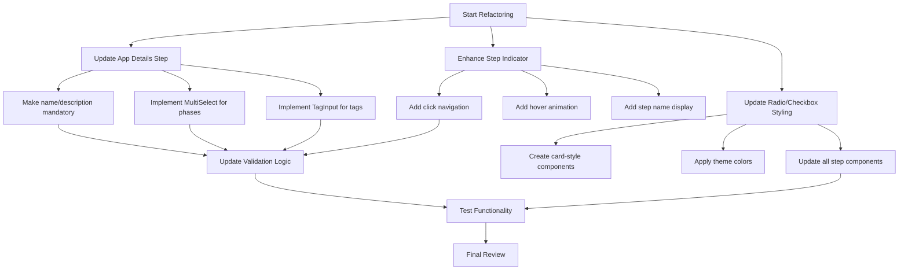

# Tech Stack Wizard Refactoring Plan

Based on my analysis of the current Tech Stack Wizard implementation, I've developed a comprehensive plan to implement the requested changes. The refactoring will focus on improving the user experience, making certain fields mandatory, enhancing the step navigation, and updating the UI components to match the design requirements.

## 1. Current Implementation Analysis

The Tech Stack Wizard currently consists of:

- A main wizard component (`web/src/app/(protected)/techstack/page.tsx`) that manages the overall flow
- Individual step components for each part of the wizard
- Jotai atoms for state management
- Basic validation for each step
- Simple step indicator that shows progress but isn't interactive

## 2. Required Changes

### 2.1. App Name and Description Fields (Mandatory)

Currently, only the app name is required. We need to:

- Make both app name and description mandatory
- Update the validation logic in both the App Details step and the main wizard component
- Add visual indicators to show these fields are required

### 2.2. Phase Multiselect

The current phase selection uses checkboxes. We need to:

- Replace with the MultiSelect component (as used in the Add New Prompt modal)
- Ensure proper styling and functionality
- Maintain the existing data structure for compatibility

### 2.3. Tags Input

The current tags implementation needs to be updated to:

- Use the TagInput component (similar to the course form)
- Allow adding tags by typing and pressing comma or enter
- Display tags above the input box
- Provide ability to remove tags

### 2.4. Step Indicator Enhancement

The current step indicator is non-interactive. We need to:

- Make each step clickable to navigate directly to that step
- Add hover animation using framer-motion
- Show step name on hover below the indicator
- Ensure proper validation when skipping steps

### 2.5. Radio and Checkbox Items Styling

Current radio and checkbox items are basic. We need to:

- Convert them to card-style components
- Use the established theme colors (not purple)
- Maintain the existing functionality
- Ensure consistent styling across all steps

## 3. Implementation Plan



## 4. Detailed Implementation Steps

### 4.1. App Details Step Updates

1. Modify `app-details-step.tsx`:

   - Update the description field to be required
   - Add visual indicators (asterisks) for both name and description fields
   - Add proper validation messages

2. Update the validation logic in `page.tsx`:
   - Modify the `validateCurrentStep` function to check both name and description
   - Update error messages to reflect both fields being required

### 4.2. Phase Multiselect Implementation

1. Replace the current checkbox implementation in `app-details-step.tsx` with the MultiSelect component:

   - Import the MultiSelect component
   - Create phase options array with label/value pairs
   - Implement the onChange handler to update the wizard state
   - Ensure proper styling and layout

2. Update the display of selected phases to match the design

### 4.3. Tags Input Implementation

1. Replace the current tags implementation in `app-details-step.tsx` with the TagInput component:
   - Import the TagInput component
   - Implement the onChange handler to update the wizard state
   - Ensure tags appear above the input box
   - Add functionality to remove tags

### 4.4. Step Indicator Enhancement

1. Modify the step indicator in `page.tsx`:

   - Add click handlers to navigate to specific steps
   - Implement validation checks when skipping steps
   - Add framer-motion animations for hover effects
   - Create a component to display step names on hover

2. Create a new component for the enhanced step indicator:
   - Implement hover animations using framer-motion
   - Add tooltip or expanding element to show step name
   - Ensure accessibility for keyboard navigation

### 4.5. Radio and Checkbox Items Styling

1. Create reusable card-style components for radio and checkbox items:

   - Design consistent card styling using theme colors
   - Ensure proper hover and selected states
   - Maintain accessibility

2. Update all step components to use the new card-style components:
   - `app-type-step.tsx`
   - `frontend-step.tsx`
   - `backend-step.tsx`
   - `database-step.tsx`
   - `ai-agent-step.tsx`
   - `integrations-step.tsx`
   - `deployment-step.tsx`

## 5. Testing Plan

1. Test each step individually:

   - Verify mandatory fields validation
   - Test phase multiselect functionality
   - Test tags input functionality
   - Verify step navigation works correctly

2. Test the complete wizard flow:

   - Verify all steps can be completed
   - Test skipping steps via the step indicator
   - Verify data is saved correctly
   - Test edit mode functionality

3. Test edge cases:
   - Verify validation when skipping steps
   - Test with various input combinations
   - Verify mobile responsiveness

## 6. Implementation Timeline

1. **Day 1**: Update App Details Step and validation logic
2. **Day 1-2**: Implement Phase Multiselect and Tags Input
3. **Day 2-3**: Enhance Step Indicator with animations and navigation
4. **Day 3-4**: Update Radio and Checkbox Items styling
5. **Day 5**: Testing and refinement

## 7. Potential Challenges and Solutions

1. **Challenge**: Maintaining validation when allowing users to skip steps
   **Solution**: Implement a comprehensive validation system that checks all previous steps when navigating

2. **Challenge**: Ensuring consistent styling across all components
   **Solution**: Create reusable styled components that can be used across all steps

3. **Challenge**: Balancing animation performance with user experience
   **Solution**: Use efficient framer-motion animations with proper memoization to prevent re-renders

## 8. Code Samples

### 8.1. Enhanced Step Indicator Component

```tsx
// StepIndicator.tsx
import { motion } from "framer-motion";
import { useState } from "react";

interface StepIndicatorProps {
  currentStep: number;
  totalSteps: number;
  stepNames: string[];
  onStepClick: (step: number) => void;
}

export function StepIndicator({
  currentStep,
  totalSteps,
  stepNames,
  onStepClick,
}: StepIndicatorProps) {
  const [hoveredStep, setHoveredStep] = useState<number | null>(null);

  return (
    <div className="flex items-center justify-between mb-8 max-w-[70%]">
      <div className="flex items-center w-full">
        {Array.from({ length: totalSteps }).map((_, index) => (
          <div
            key={`step-group-${index + 1}`}
            className="relative flex-1 flex flex-col items-center"
          >
            <motion.div
              className={`flex items-center justify-center h-10 w-10 rounded-full cursor-pointer ${
                currentStep >= index + 1
                  ? "bg-primary text-primary-foreground"
                  : "bg-muted"
              }`}
              whileHover={{ scale: 1.1 }}
              onClick={() => onStepClick(index + 1)}
              onMouseEnter={() => setHoveredStep(index + 1)}
              onMouseLeave={() => setHoveredStep(null)}
            >
              {currentStep > index + 1 ? (
                <CheckIcon className="h-5 w-5" />
              ) : (
                index + 1
              )}
            </motion.div>

            {/* Step name tooltip */}
            {hoveredStep === index + 1 && (
              <motion.div
                className="absolute top-12 bg-popover text-popover-foreground px-3 py-1 rounded-md shadow-md text-sm"
                initial={{ opacity: 0, y: -5 }}
                animate={{ opacity: 1, y: 0 }}
                transition={{ duration: 0.2 }}
              >
                {stepNames[index]}
              </motion.div>
            )}

            {/* Connector line */}
            {index < totalSteps - 1 && (
              <div
                className={`flex-1 h-1 ${
                  currentStep > index + 1 ? "bg-primary" : "bg-muted"
                }`}
              ></div>
            )}
          </div>
        ))}
      </div>
    </div>
  );
}
```

### 8.2. Card-Style Radio Component

```tsx
// CardRadio.tsx
import { RadioGroupItem } from "@/components/ui/radio-group";
import { Label } from "@/components/ui/label";
import { motion } from "framer-motion";

interface CardRadioProps {
  value: string;
  id: string;
  label: string;
  checked: boolean;
}

export function CardRadio({ value, id, label, checked }: CardRadioProps) {
  return (
    <motion.div
      className={`flex items-center space-x-2 border rounded-lg p-4 cursor-pointer hover:bg-accent ${
        checked ? "border-primary bg-primary/10" : "border-border"
      }`}
      whileHover={{ scale: 1.02 }}
      transition={{ duration: 0.2 }}
    >
      <RadioGroupItem value={value} id={id} />
      <Label htmlFor={id} className="flex-1 cursor-pointer">
        {label}
      </Label>
    </motion.div>
  );
}
```

### 8.3. Card-Style Checkbox Component

```tsx
// CardCheckbox.tsx
import { Checkbox } from "@/components/ui/checkbox";
import { Label } from "@/components/ui/label";
import { motion } from "framer-motion";

interface CardCheckboxProps {
  id: string;
  label: string;
  checked: boolean;
  onCheckedChange: (checked: boolean) => void;
}

export function CardCheckbox({
  id,
  label,
  checked,
  onCheckedChange,
}: CardCheckboxProps) {
  return (
    <motion.div
      className={`flex items-center space-x-2 border rounded-lg p-4 cursor-pointer hover:bg-accent ${
        checked ? "border-primary bg-primary/10" : "border-border"
      }`}
      whileHover={{ scale: 1.02 }}
      transition={{ duration: 0.2 }}
    >
      <Checkbox
        id={id}
        checked={checked}
        onCheckedChange={(checked) => onCheckedChange(checked === true)}
      />
      <Label htmlFor={id} className="flex-1 cursor-pointer">
        {label}
      </Label>
    </motion.div>
  );
}
```

## 9. Conclusion

This refactoring plan addresses all the requested changes while maintaining the existing functionality of the Tech Stack Wizard. The implementation will focus on improving the user experience, making the wizard more intuitive, and enhancing the visual appeal of the components.
